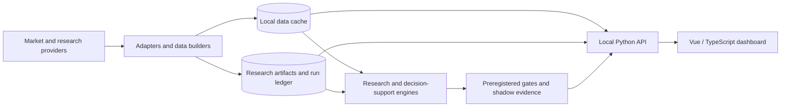

# TradeCentral

TradeCentral is a local-first quantitative market research and decision-support workstation for US equities and options. It combines market scanning, options intelligence, flow analysis, research diagnostics, model governance, and shadow-trading evidence behind a single desktop-oriented interface.

The system is intentionally designed as a research instrument rather than an execution terminal. It can surface candidates, diagnostics, model evidence, options structures, and readiness state, but the checked-in decision-support pipeline does not place or route broker orders.

> **Current operating posture:** research and shadow evidence first. Treat every model, scanner, and options surface as decision support unless the relevant preregistered gate and promotion criteria explicitly say otherwise.

## What TradeCentral contains

TradeCentral is split into four cooperating layers:

1. **Research and evaluation** — point-in-time datasets, leak-resistant evaluation, model challengers, factor diagnostics, regime analysis, preregistered gates, and experiment artifacts.
2. **Decision-support pipelines** — typed candidate contracts, adapter boundaries, evidence fusion, options validation, risk checks, shadow lifecycle tracking, and fail-closed promotion logic.
3. **Local API and artifact services** — a loopback-only Python API that serves market data, research artifacts, options intelligence, health/readiness state, and the compiled dashboard.
4. **Operator dashboard** — a Vue 3 and TypeScript interface built for dense market inspection, explicit provenance, visible stale/error states, and keyboard-first navigation.



For the complete system boundary, runtime topology, data paths, and safety model, see [`docs/ARCHITECTURE.md`](docs/ARCHITECTURE.md).

For the visual system, navigation model, component rules, chart semantics, and interaction standards, see [`docs/DESIGN.md`](docs/DESIGN.md).

## Workspaces

The current dashboard is organized around five primary workspaces and a set of specialist research surfaces.

| Workspace | Purpose |
|---|---|
| **Desk** | Operator posture, queue, market state, readiness, and high-level activity |
| **Market** | Symbol research, price trajectory, factor context, comparison, and cross-asset inspection |
| **Options** | Single-underlier options intelligence, positioning, gamma structure, ranges, and contract context |
| **Flow** | Market-wide flow, sector activity, unusual options attention, and latent flow-state research |
| **Research** | Methods, models, diagnostics, experiments, and governance surfaces |

Specialist routes currently include Sectors, Pulse, Momentum, Fintel, Gates, Evolution, Live Blend, Graph, Breaks, and Cloud. The route definitions in [`dashboard/src/router.ts`](dashboard/src/router.ts) are the source of truth for the current workspace inventory.

## Core capabilities

### Market intelligence

- Broad-universe symbol search and historical trajectory inspection
- Rebased multi-symbol comparison and return correlation
- Sector rotation and relative-strength context
- Market clock based on the XNYS exchange calendar rather than weekday assumptions
- Sentiment and anomaly diagnostics with source, timestamp, and data-quality context
- Momentum pre-scan and adaptive multi-stream scoring surfaces

### Options and flow

- Truth-preserving call/put activity views
- Gamma-by-strike and GEX topology
- Risk-neutral implied-range diagnostics
- Live or cached options-chain inspection
- Unusual-flow attention boards
- Short-interest, borrow, FTD, ownership, and related Fintel integrations when credentials are configured
- Explicit degraded/proxy states when the underlying dataset cannot support a stronger claim

### Research and governance

- Leak-resistant walk-forward evaluation harness
- Split-conformal utilities and evaluation property tests
- Factor research, regime diagnostics, Bayesian changepoints, and genetic-algorithm experiments
- Preregistered GO/NO-GO artifacts
- Experiment and shadow ledgers
- Readiness surfaces that keep research evidence separate from capital authorization

### Decision support

- Canonical typed contracts for plays, confidence, risk, and option legs
- Provider adapters that normalize external payloads before they reach core logic
- Evidence fusion without silently converting ordinal research signals into calibrated probability
- Contract and quote validation with freshness, liquidity, DTE, delta, spread, and risk checks
- Shadow-only lifecycle accounting and promotion reports
- No broker or order-routing integration in the core checked-in pipeline

## Technology

| Layer | Current implementation |
|---|---|
| Frontend | Vue 3, TypeScript, Vue Router, Vite |
| Frontend testing | Vitest, `vue-tsc` |
| Visualization | Dependency-light SVG chart primitives plus Three.js where 3D rendering is required |
| API | Python `http.server` with threaded request handling |
| Data / numerical work | pandas, NumPy and research-specific Python packages |
| Market calendar | `exchange_calendars` |
| Research | Local Python modules, Qlib workflows, model artifacts, point-in-time datasets |
| Persistence | Filesystem-first datasets, JSON/JSONL/Parquet artifacts, run directories, model files |
| Cloud research | Optional GCP / Vertex AI tooling for isolated training workflows |

The operator runtime dependencies are intentionally kept separate from the frozen model-training environment so dashboard changes do not silently change model reproducibility.

## Repository layout

```text
.
├── config/                 Frozen universes and decision-support policy
├── daily_plays/            Decision-support contracts, adapters, fusion, validation, shadow logic
├── dashboard/              Vue 3 operator interface
│   └── src/
│       ├── api.ts          Typed API client
│       ├── charts/         SVG scales, paths, and statistics
│       ├── components/     Reusable instrument components
│       ├── composables/    Polling and shared resource behavior
│       ├── styles/         Design tokens and global visual rules
│       └── views/          Routed workspaces
├── docs/                   Gates, results, runbooks, architecture, and design documentation
├── eval/                   Leak-resistant evaluation harness and tests
├── models/                 Frozen or versioned research/model artifacts
├── research/               Offline research primitives and experiments
├── tools/                  API server, data builders, diagnostics, launchers, and operators
├── requirements-dashboard.txt
├── requirements-vertex.txt
└── README.md
```

`data/` and `runs/` are intentionally ignored because they contain regenerable local datasets and experiment/runtime artifacts. Secrets and local environments are ignored as well.

## Important checkout convention

The codebase still uses the internal Python/runtime namespace **`edge`**. Several launchers resolve paths assuming this repository is checked out as an `edge/` directory inside a workspace root.

For a clean standalone setup, clone the repository using `edge` as the local directory name:

```bash
mkdir tradecentral-workspace
cd tradecentral-workspace
git clone git@github.com:syrilj/tradecentral.git edge
```

This preserves the path assumptions used by scripts such as `edge/tools/run_dashboard.sh` and `edge/tools/api_server.py`.

The product/repository name is TradeCentral; `edge` is currently the internal package and filesystem namespace. Renaming that namespace is a separate refactor and should not be mixed into documentation-only changes.

## Running the dashboard

### Prerequisites

- Python 3 with the project numerical/research environment available
- Node.js 18 or newer
- npm
- Optional provider credentials in a local `.env`

The launcher prefers `edge/.venv-qlib/bin/python` when that environment exists and falls back to `python3`. It automatically installs the dashboard Node dependencies when needed and installs the small operator-only Python requirement set from `edge/requirements-dashboard.txt`.

From the workspace root:

```bash
# Build the Vue app and serve the API + compiled dashboard on localhost:8787
bash edge/tools/run_dashboard.sh

# Development mode: Vite HMR on localhost:5178 with /api proxied to localhost:8787
bash edge/tools/run_dashboard.sh --dev

# Serve an existing build without rebuilding
bash edge/tools/run_dashboard.sh --serve
```

The API binds to `127.0.0.1`. That is deliberate: the current operator surface is not an authenticated multi-user web service and should not be exposed directly to a LAN or public interface.

## Configuration and credentials

Copy the example environment file and add only the credentials required by the providers you intend to use.

```bash
cp edge/.env.example edge/.env
```

Provider integrations are expected to fail visibly and degrade honestly when a key, dataset, artifact, or service is unavailable. Do not commit `.env`, private keys, provider tokens, downloaded model binaries, or generated market data.

## Tests and validation

Frontend:

```bash
cd edge/dashboard
npm test
npm run build
```

Core leak-resistance checks:

```bash
cd <workspace-root>
python3 -m pytest edge/eval -q
```

The repository also contains strategy-specific tests, gate artifacts, preflight tools, and reproducibility checks. A passing UI build is not evidence that a model is tradeable; model authorization must come from the relevant research protocol and promotion record.

## Data and artifact discipline

TradeCentral distinguishes between three classes of state:

- **Source data** — local OHLCV, option snapshots, and provider-derived caches under `data/`.
- **Computed artifacts** — research results, diagnostics, graph/factor/changepoint outputs, dashboard build output, shadow logs, and experiment runs under `runs/`.
- **Versioned evidence** — configuration, model code, gates, runbooks, and result documents committed to Git.

The dashboard should never fabricate a missing artifact to make a view look complete. Missing, stale, degraded, proxy, and unavailable states are first-class outcomes.

## Safety model

The project is designed to fail closed:

- research evidence cannot silently become calibrated model probability;
- stale or missing data is shown as stale or missing rather than converted to zero;
- a dashboard readiness indicator is an operator interlock, not a substitute for strategy-specific promotion criteria;
- expensive research artifacts are normally built offline rather than recomputed by incidental UI polling;
- one malformed symbol or artifact should not terminate the entire local API process;
- the decision-support pipeline does not contain broker order submission or routing.

See [`docs/ARCHITECTURE.md`](docs/ARCHITECTURE.md) for the detailed trust boundaries and [`docs/DESIGN.md`](docs/DESIGN.md) for the UI rules that make those states visible.

## Existing research records

The repository contains historical audits, gate definitions, gate results, runbooks, and model-specific research notes under [`docs/`](docs/). Those documents intentionally preserve the evidence available when each experiment was run.

Do not summarize the current system state from an old result file alone. For operator decisions, use the latest artifacts, the Gates/Research surfaces, and the current run ledger.

## Development principles

1. Preserve point-in-time causality and provenance.
2. Keep research, diagnostics, and decision authorization as separate concepts.
3. Prefer explicit nulls and unavailable states over fabricated precision.
4. Build expensive research offline; serve artifacts cheaply.
5. Keep provider-specific payloads behind adapter boundaries.
6. Keep the operator UI dense, legible, and semantically consistent.
7. Make a failed or stale dependency obvious to the operator.
8. Treat every promotion decision as evidence-bound and reproducible.

---

TradeCentral is quantitative research software. Backtests, model scores, flow metrics, option analytics, and simulated/shadow outcomes are not guarantees of future performance or financial advice.
