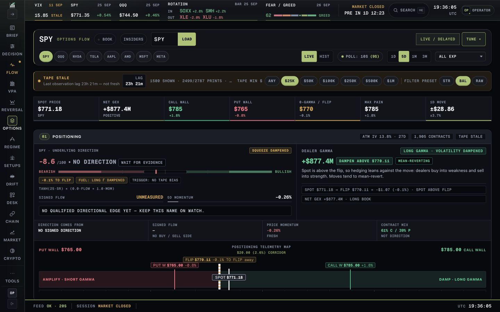
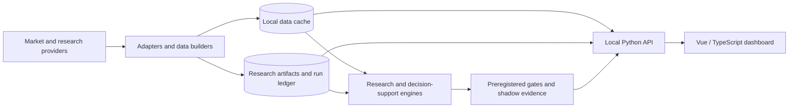
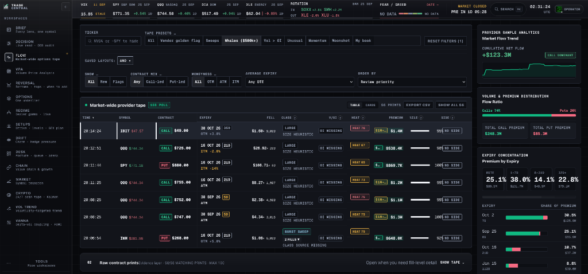
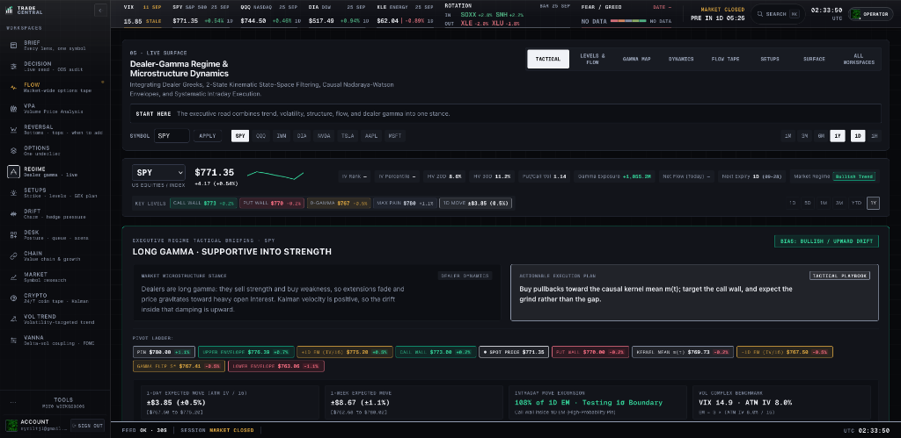
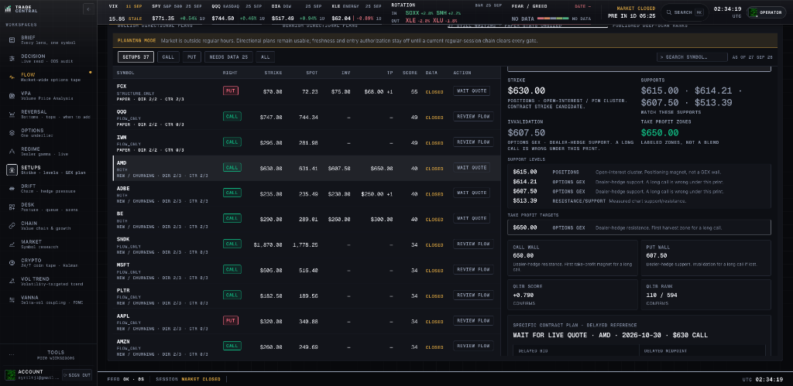
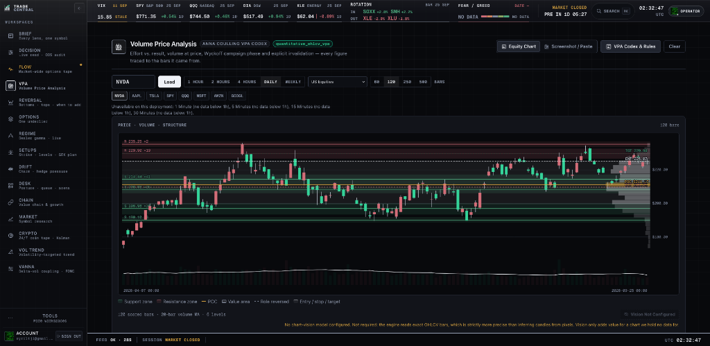
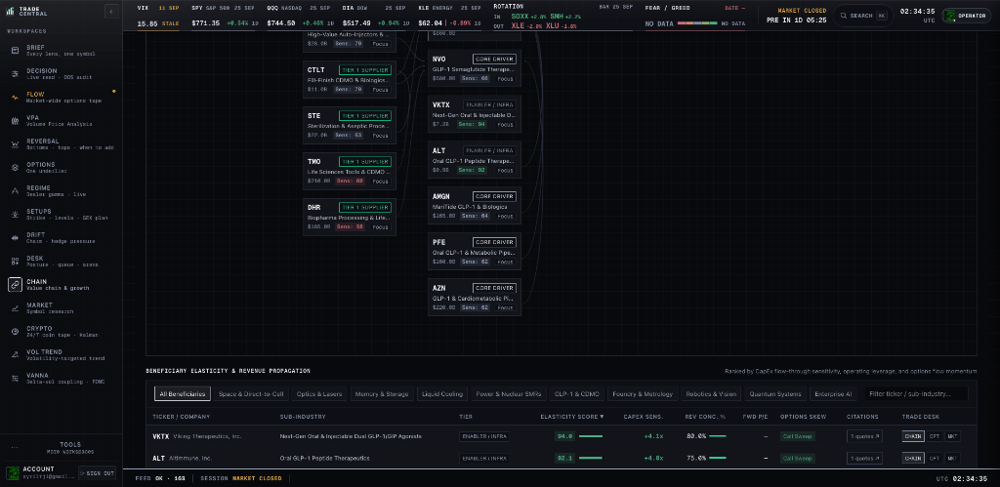
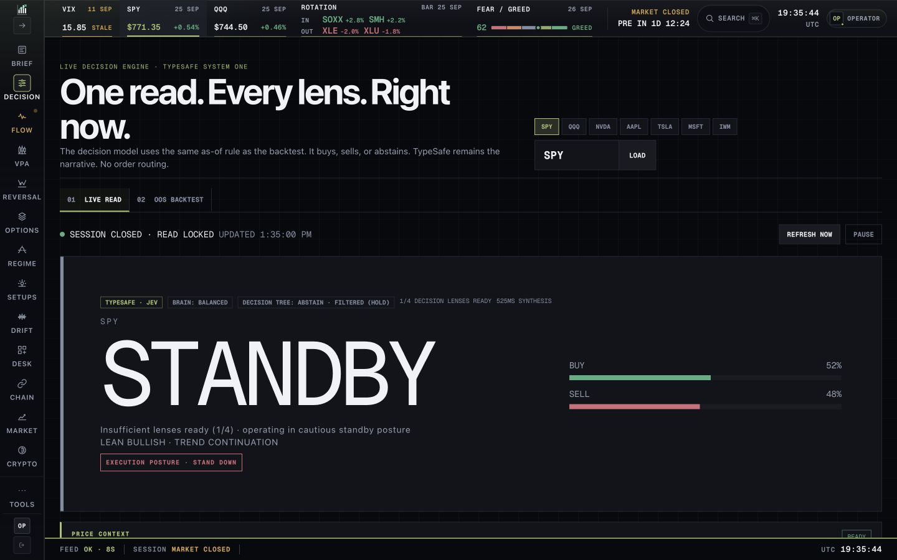

# TradeCentral

<p align="center">
  
</p>

<p align="center">
  <strong>Local-First Quantitative Market Research & Options Intelligence Workstation</strong>
  <br />
  <em>Options Flow Tape · Dealer Gamma Exposure (GEX) · Microstructure Regimes · Volume Price Analysis (VPA) · Directional Setups · Value Chains · Multi-Lens Decision Fusion</em>
</p>

<p align="center">
  <a href="#workstation-tour"></a>
  <a href="#workspaces"></a>
  <a href="docs/SHOWCASE.md"></a>
  
  
  
  
  
</p>

---

TradeCentral is a local-first quantitative market research and decision-support workstation for US equities and options. It combines high-conviction options flow scanning, real-time dealer gamma exposure (GEX), volume price analysis (VPA / Wyckoff), kinematic microstructure regimes, thematic value-chain elasticity, and shadow-trading model governance behind a single desktop-oriented interface.

The system is intentionally engineered as an institutional research instrument rather than an execution terminal. It surfaces candidates, diagnostics, model evidence, contract structures, and readiness gates, but the checked-in pipeline strictly adheres to a **fail-closed, decision-support-only architecture** that does not place or route broker orders.

*Actual local workstation captures shown below. Data age, provider sources, and risk states are displayed throughout the interface. See [more product views and technical highlights](docs/SHOWCASE.md).*

> **Current operating posture:** research and shadow evidence first. Treat every model, scanner, and options surface as decision support unless the relevant preregistered gate and promotion criteria explicitly say otherwise.

## What TradeCentral contains

TradeCentral is split into four cooperating layers:

1. **Research and evaluation** — point-in-time datasets, leak-resistant evaluation, model challengers, factor diagnostics, regime analysis, preregistered gates, and experiment artifacts.
2. **Decision-support pipelines** — typed candidate contracts, adapter boundaries, evidence fusion, options validation, risk checks, shadow lifecycle tracking, and fail-closed promotion logic.
3. **Local API and artifact services** — a loopback-only Python API that serves market data, research artifacts, options intelligence, health/readiness state, and the compiled dashboard.
4. **Operator dashboard** — a Vue 3 and TypeScript interface with Clerk owner authentication, explicit provenance, visible stale/error states, and keyboard-first navigation.



### Architecture and security highlights

- **Local research runtime:** Python serves data and artifacts from a loopback-only API; point-in-time inputs and research runs remain filesystem based.
- **Typed decision pipeline:** provider adapters normalize inputs into typed contracts, then validation and promotion gates fail closed when evidence is missing or unsafe.
- **Owner-scoped web access:** Clerk authenticates the dashboard, while the API and Convex independently enforce the configured owner identity. Convex stores only the small watchlist.
- **Preview boundary:** Cloudflare serves the static app and waitlist. Its API proxy is disabled, so the preview cannot fetch live research data. The preview's Clerk development instance is not a production auth boundary.

For the live preview's current boundaries and deployment details, see [`docs/CLOUDFLARE_DEPLOYMENT.md`](docs/CLOUDFLARE_DEPLOYMENT.md).

For the complete system boundary, runtime topology, data paths, and safety model, see [`docs/ARCHITECTURE.md`](docs/ARCHITECTURE.md).

For the visual system, navigation model, component rules, chart semantics, and interaction standards, see [`docs/DESIGN.md`](docs/DESIGN.md).

## Workstation Tour

TradeCentral replaces fragmented browser tabs and black-box trading alerts with an integrated, provenance-backed quantitative workstation. Every readout displays its data age, provider source, and confidence bounds.

### 1. Market-Wide Options Flow Tape & Real-Time Analytics

*Real-time provider options tape with 15s polling, sweep/block detection, whale orders ($500k+), vendor golden sweeps, cumulative net flow trend, and multi-tier expiry concentration.*

- **Institutional Tape Reading:** Tracks live options transactions with granular filters for aggressive Sweeps, Whale prints ($500k+), Volume > OI, and Unusual Moneyness.
- **Provider Analytics:** Real-time cumulative net flow curve, call vs. put volume & premium distribution (e.g. Call Dominant flow), and premium concentration by DTE brackets (0 DTE, 1–7D, 8–30D, 30D+).
- **Execution Classification:** Heuristic trade categorization distinguishes between institutional size, burst sweeps, and multi-exchange fills with transparent missing-OI flags.

### 2. Dealer-Gamma Regime & Microstructure Dynamics

*Executive regime briefing showing SPY Long Gamma stance, 2-state kinematic state-space filtering, pivot ladder, and 1-day/1-week expected move excursions.*

- **Dealer Microstructure Modeling:** Models whether market makers are in **Long Gamma** (damping volatility by selling strength and buying dips) or **Short Gamma** (accelerating price trends via directional delta-hedging).
- **Kinematic Filtering & Envelopes:** 2-state kinematic state-space filtering and causal Nadaraya-Watson kernel envelopes provide noise-reduced price trajectories without lookahead bias.
- **Microstructure Pivot Ladder:** Real-time calculated Call Wall, Put Wall, Gamma Flip Point, Kernel Mean ($m(t)$), and $\pm 1\sigma$ Expected Move bounds ($ATM \cdot IV / \sqrt{252}$).

### 3. Directional Setups & Strike Execution Planning

*Bullish & Bearish directional plans with planning mode safety gating, QLIR scores, exact contract strike candidates, dealer-hedge support levels, and take-profit targets.*

- **Gated Execution Workflow:** Operates in Planning Mode outside regular trading hours and strictly enforces multi-condition freshness gates before authorizing live directional entries.
- **Exact Contract Candidates:** Pinpoints recommended strike candidates based on open interest clusters, gamma pin levels, and delta-liquidity profiles.
- **Asymmetric Risk Profiles:** Automatically computes invalidation levels anchored to dealer-hedge support prints and tiered take-profit targets aligned with dealer call walls.

### 4. Volume Price Analysis (VPA) & Wyckoff Campaign Phase

*Volume-price analysis on exact OHLCV bars: effort versus result, campaign phase, volume-profile POC, and value areas.*

- **Effort vs. Result Verification:** Evaluates candle spread versus traded volume to detect institutional absorption, stopping volume, tests of supply, and distribution spikes.
- **Volume Profile & Value Area:** High-resolution volume distribution highlighting Point of Control (POC), Value Area High (VAH), and Value Area Low (VAL).
- **Role-Reversed Price Levels:** Algorithmic identification of dynamic support and resistance zones with bar-level evidence tracing.

### 5. Thematic Value Chain Elasticity & Revenue Propagation

*Thematic supply-chain node topology (GLP-1 & CDMO, Advanced Semiconductor, AI Infrastructure), CapEx sensitivity, revenue concentration, and options skew.*

- **Supply Chain Node Topology:** Maps interdependencies across Core Drivers, Tier 1 Suppliers, and Infrastructure Enablers across emerging industry megatrends.
- **CapEx Flow-Through Sensitivity:** Quantifies operating leverage and downstream revenue propagation resulting from upstream capital expenditure announcements.
- **Derivative Alignment:** Correlates fundamental supply chain positioning with options order-flow momentum and implied volatility skew.

### 6. Options Positioning & Dealer Exposure (GEX)

*Underlier options positioning showing net gamma exposure, call/put open interest distribution, dealer resistance walls, and source freshness.*

- **Net Gamma by Strike:** Visualizes dealer gamma positioning across all active strikes to locate high-probability price magnets and volatility suppression pins.
- **Risk-Neutral Implied Density:** Extracts market-implied probability distributions and skew from option quotes without parametric assumptions.

### 7. Decision Brain Consensus Engine & Live Read

*Decision Brain consensus engine combining regime, structure, flow, and valuation lenses with explicit standby and out-of-sample capital validation.*

- **Multi-Lens Evidence Fusion:** Requires independent quantitative models (VPA, Dealer Gamma, Flow Tape, Trend Kinematics) to reach strict consensus before signaling conviction.
- **Fail-Closed Governance:** Reverts to explicit **Standby** whenever source quotes are stale, spread thresholds are violated, or model agreement is insufficient.

## Workspaces

The operator workstation is organized around 15 specialized surfaces designed for institutional market research and tactical decision support:

| Workspace | Route | Core Quantitative Focus | Key Capabilities |
| :--- | :--- | :--- | :--- |
| **Brief** | `/brief` | Symbol Overview & Multi-Lens Summary | Unified snapshot of technical structure, dealer gamma, options flow, and valuation for any ticker. |
| **Decision** | `/decision` | Consensus Engine & OOS Capital Audit | Multi-model decision brain aggregating independent research lenses with fail-closed safety gating. |
| **Flow** | `/flow` | Market-Wide Options Tape & Order Flow | 15s polled provider tape, sweep/whale detection, golden flags, cumulative net flow, and expiry concentration. |
| **VPA** | `/vpa` | Volume Price Analysis & Wyckoff Codex | Effort vs. result volume validation, Wyckoff campaign phase detection, Volume Profile POC, and value areas. |
| **Reversal** | `/reversal` | Exhaustion & Turning Point Detection | Identifies oversold/overbought exhaustion extremes, institutional absorption, and trend inflection points. |
| **Options** | `/options` | Single-Underlier Options Intelligence | Strike-by-strike GEX topology, open interest distribution, call/put resistance walls, and implied ranges. |
| **Regime** | `/regime` | Dealer Gamma & Microstructure Dynamics | Long/short gamma stances, kinematic state-space filters, Nadaraya-Watson envelopes, and expected move bounds. |
| **Setups** | `/suggest` | Directional Strike & Execution Planning | Systematic directional candidate ranking, QLIR scores, target strikes, invalidation levels, and take-profit zones. |
| **Drift** | `/drift` | Charm & Dynamic Hedge Pressure | Models second-order dealer hedging drift (delta decay with time/charm) and expected intraday price pressure. |
| **Desk** | `/desk` | Operator Posture & Execution Queue | High-level market status, readiness checklist, active candidates, and portfolio risk telemetry. |
| **Chain** | `/chain` | Value Chain & Revenue Propagation | Interactive node graphs across megatrends (GLP-1, AI, Semis), CapEx elasticity scores, and revenue concentration. |
| **Market** | `/market` | Multi-Asset Research & Factor Context | Broad universe search, multi-symbol trajectory rebasing, correlation matrices, and sector relative strength. |
| **Crypto** | `/crypto` | 24/7 Digital Asset Tape & Kalman Velocity | Continuous crypto asset tracking with kinematic state filtering and trend-velocity scoring. |
| **Vol Trend** | `/voltrend` | Volatility-Targeted Momentum | Trend-following strategies with dynamic volatility scaling and risk-budget allocation. |
| **Vanna** | `/vanna` | Delta-Vol Coupling & Event Pricing | Cross-greeks surface modeling second-order delta sensitivity to implied volatility shifts ahead of major catalysts. |

Specialist sub-routes and research lab surfaces include Sectors (`/sectors`), Pulse (`/pulse`), Momentum (`/momentum`), Fintel Short/Borrow (`/fintel`), Preregistered Gates (`/gates`), Model Evolution (`/evolution`), Live Blend (`/live`), Graph (`/graph`), Breaks (`/breaks`), Cloud Watchlist (`/cloud`), and Kalman Velocity (`/kalman`). The route definitions in [`dashboard/src/router.ts`](dashboard/src/router.ts) serve as the source of truth for the complete workspace inventory.

## Core capabilities

### Market intelligence

- Broad-universe symbol search and historical trajectory inspection
- Rebased multi-symbol comparison and return correlation
- Sector rotation and relative-strength context
- Market clock based on the XNYS exchange calendar rather than weekday assumptions
- Sentiment and anomaly diagnostics with source, timestamp, and data-quality context
- Momentum pre-scan and adaptive multi-stream scoring surfaces

### Options and flow

- Truth-preserving call/put activity views
- Gamma-by-strike and GEX topology
- Risk-neutral implied-range diagnostics
- Live or cached options-chain inspection
- Unusual-flow attention boards
- Short-interest, borrow, FTD, ownership, and related Fintel integrations when credentials are configured
- Explicit degraded/proxy states when the underlying dataset cannot support a stronger claim

### Research and governance

- Leak-resistant walk-forward evaluation harness
- Split-conformal utilities and evaluation property tests
- Factor research, regime diagnostics, Bayesian changepoints, and genetic-algorithm experiments
- Preregistered GO/NO-GO artifacts
- Experiment and shadow ledgers
- Readiness surfaces that keep research evidence separate from capital authorization

### Decision support

- Canonical typed contracts for plays, confidence, risk, and option legs
- Provider adapters that normalize external payloads before they reach core logic
- Evidence fusion without silently converting ordinal research signals into calibrated probability
- Contract and quote validation with freshness, liquidity, DTE, delta, spread, and risk checks
- Shadow-only lifecycle accounting and promotion reports
- No broker or order-routing integration in the core checked-in pipeline

## Technology

| Layer                 | Current implementation                                                                                                                                                           |
| --------------------- | -------------------------------------------------------------------------------------------------------------------------------------------------------------------------------- |
| Frontend              | Vue 3, TypeScript, Vue Router, Vite                                                                                                                                              |
| Frontend design       | Dark "instrument" design-token system for the desk (`tokens.css`, `base.css`, `docs/DESIGN.md`); public landing/auth use a warm editorial paper system scoped inside their views |
| Frontend testing      | Vitest, `vue-tsc`, static design-conformance guard test                                                                                                                          |
| Visualization         | Dependency-light SVG chart primitives plus Three.js where 3D rendering is required                                                                                               |
| API                   | Python `http.server` with threaded request handling                                                                                                                              |
| Web auth / hosting    | Clerk owner sign-in, owner-scoped Convex watchlist, Cloudflare Workers preview                                                                                                    |
| Data / numerical work | pandas, NumPy and research-specific Python packages                                                                                                                              |
| Market calendar       | `exchange_calendars`                                                                                                                                                             |
| Research              | Local Python modules, Qlib workflows, model artifacts, point-in-time datasets                                                                                                    |
| Persistence           | Filesystem-first datasets, JSON/JSONL/Parquet artifacts, run directories, model files                                                                                            |
| Cloud research        | Optional GCP / Vertex AI tooling for isolated training workflows                                                                                                                 |

The operator runtime dependencies are intentionally kept separate from the frozen model-training environment so dashboard changes do not silently change model reproducibility.

## Repository layout

```text
.
├── config/                 Frozen universes and decision-support policy
├── daily_plays/            Decision-support contracts, adapters, fusion, validation, shadow logic
├── dashboard/              Vue 3 operator interface
│   └── src/
│       ├── api.ts          Typed API client
│       ├── charts/         SVG scales, paths, and statistics
│       ├── components/     Reusable instrument components
│       ├── composables/    Polling and shared resource behavior
│       ├── styles/         Design tokens and global visual rules
│       └── views/          Routed workspaces
├── docs/                   Gates, results, runbooks, architecture, and design documentation
├── eval/                   Leak-resistant evaluation harness and tests
├── models/                 Frozen or versioned research/model artifacts
├── research/               Offline research primitives and experiments
├── tools/                  API server, data builders, diagnostics, launchers, and operators
├── requirements-dashboard.txt
├── requirements-vertex.txt
└── README.md
```

`data/` and `runs/` are intentionally ignored because they contain regenerable local datasets and experiment/runtime artifacts. Secrets and local environments are ignored as well.

## Important checkout convention

The codebase still uses the internal Python/runtime namespace **`edge`**. Several launchers resolve paths assuming this repository is checked out as an `edge/` directory inside a workspace root.

For a clean standalone setup, clone the repository using `edge` as the local directory name:

```bash
mkdir tradecentral-workspace
cd tradecentral-workspace
git clone git@github.com:syrilj/tradecentral.git edge
```

This preserves the path assumptions used by scripts such as `edge/tools/run_dashboard.sh` and `edge/tools/api_server.py`.

The product/repository name is TradeCentral; `edge` is currently the internal package and filesystem namespace. Renaming that namespace is a separate refactor and should not be mixed into documentation-only changes.

## Running the dashboard

### Prerequisites

- Python 3 with the project numerical/research environment available
- Node.js 18 or newer
- npm
- Optional provider credentials in a local `.env`

The launcher prefers `edge/.venv-qlib/bin/python` when that environment exists and falls back to `python3`. It automatically installs the dashboard Node dependencies when needed and installs the small operator-only Python requirement set from `edge/requirements-dashboard.txt`.

From the workspace root:

```bash
# Build the Vue app and serve the API + compiled dashboard on localhost:8787
bash edge/tools/run_dashboard.sh

# Development mode: Vite HMR on localhost:5178 with /api proxied to localhost:8787
bash edge/tools/run_dashboard.sh --dev

# Serve an existing build without rebuilding
bash edge/tools/run_dashboard.sh --serve
```

The API binds to `127.0.0.1`. That is deliberate: the current operator surface is not an authenticated multi-user web service and should not be exposed directly to a LAN or public interface.

### Local operator access

For a workstation session, configure the explicit local auth mode in both the
dashboard and API environment. The public preview uses Clerk and an owner
allowlist. In either setup,
the local Python API binds to `127.0.0.1` by default; Clerk in the browser does
not make an unauthenticated API safe to expose. Public API deployment requires
server-side Clerk token verification and an exact owner identity, as described
in [`docs/PRODUCTION_DEPLOYMENT.md`](docs/PRODUCTION_DEPLOYMENT.md).

## Configuration and credentials

Copy the example environment file and add only the credentials required by the providers you intend to use.

```bash
cp edge/.env.example edge/.env
```

Provider integrations are expected to fail visibly and degrade honestly when a key, dataset, artifact, or service is unavailable. Do not commit `.env`, private keys, provider tokens, downloaded model binaries, or generated market data.

## Tests and validation

Frontend:

```bash
cd edge/dashboard
npm test
npm run build
```

Core leak-resistance checks:

```bash
cd <workspace-root>
python3 -m pytest edge/eval -q
```

The repository also contains strategy-specific tests, gate artifacts, preflight tools, and reproducibility checks. A passing UI build is not evidence that a model is tradeable; model authorization must come from the relevant research protocol and promotion record.

## Data and artifact discipline

TradeCentral distinguishes between three classes of state:

- **Source data** — local OHLCV, option snapshots, and provider-derived caches under `data/`.
- **Computed artifacts** — research results, diagnostics, graph/factor/changepoint outputs, dashboard build output, shadow logs, and experiment runs under `runs/`.
- **Versioned evidence** — configuration, model code, gates, runbooks, and result documents committed to Git.

The dashboard should never fabricate a missing artifact to make a view look complete. Missing, stale, degraded, proxy, and unavailable states are first-class outcomes.

## Safety model

The project is designed to fail closed:

- research evidence cannot silently become calibrated model probability;
- stale or missing data is shown as stale or missing rather than converted to zero;
- a dashboard readiness indicator is an operator interlock, not a substitute for strategy-specific promotion criteria;
- expensive research artifacts are normally built offline rather than recomputed by incidental UI polling;
- one malformed symbol or artifact should not terminate the entire local API process;
- the decision-support pipeline does not contain broker order submission or routing.

See [`docs/ARCHITECTURE.md`](docs/ARCHITECTURE.md) for the detailed trust boundaries and [`docs/DESIGN.md`](docs/DESIGN.md) for the UI rules that make those states visible.

## Existing research records

The repository contains historical audits, gate definitions, gate results, runbooks, and model-specific research notes under [`docs/`](docs/). Those documents intentionally preserve the evidence available when each experiment was run.

Do not summarize the current system state from an old result file alone. For operator decisions, use the latest artifacts, the Gates/Research surfaces, and the current run ledger.

## Development principles

1. Preserve point-in-time causality and provenance.
2. Keep research, diagnostics, and decision authorization as separate concepts.
3. Prefer explicit nulls and unavailable states over fabricated precision.
4. Build expensive research offline; serve artifacts cheaply.
5. Keep provider-specific payloads behind adapter boundaries.
6. Keep the operator UI dense, legible, and semantically consistent.
7. Make a failed or stale dependency obvious to the operator.
8. Treat every promotion decision as evidence-bound and reproducible.

## License and terms

Copyright (c) 2026 Syril Jacob. All Rights Reserved.

This software is released under a **Commercial Proprietary Software License and Evaluation Agreement**. It is source-available solely for personal, non-commercial evaluation, peer review, and architectural examination in non-production environments.

Unauthorized copying, distribution, modification, live trading deployment, broker integration, commercial exploitation, or ingestion into AI/LLM model training sets is strictly prohibited. See [`LICENSE`](LICENSE) for the full legally binding agreement and the dashboard at `/license` and `/terms` for terms of service and regulatory safe harbor disclaimers.

---

TradeCentral is quantitative research software. Backtests, model scores, flow metrics, option analytics, and simulated/shadow outcomes are not guarantees of future performance or financial advice.

