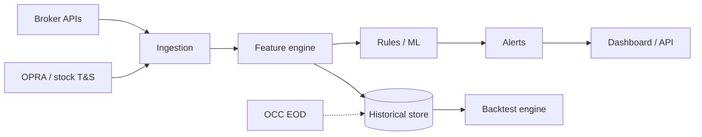

# Heavy Absorption — Streaming Design & Phased Roadmap

Status: design + working prototype (see `daily_plays/absorption.py`,
`research/absorption_backtest.py`, `/api/absorption`, `AbsorptionView.vue`).

This document is the *future* streaming architecture for true tick-level
absorption. It is deliberately separate from the shipped prototype because
the two have different data requirements and different safety postures.

## 1. What "absorption" means here

Absorption is a market-microstructure pattern: a sustained run of aggressive
volume trades through resting liquidity but price does not move as expected.
A large passive order is "absorbing" the flow and defending the level.

- **Sell absorption** (heavy selling, price holds) → passive buyer defending
  support → expected reversal **up**.
- **Buy absorption** (heavy buying, price holds) → passive seller defending
  resistance → expected reversal **down**.

The core metric is the ratio of aggressive volume to price movement at a
level: `AggressiveVolume / |ΔPrice|` very high ⇒ absorption.

## 2. The hard constraint (read this first)

TradeCentral is a **local-first research and decision-support workstation**.
`docs/ARCHITECTURE.md` lists "high-frequency execution engine" and
"low-latency market-data bus" as explicit **non-goals**, and the checked-in
pipeline has **no broker order routing**. There is no tick, quote, L2, or
time-and-sales data anywhere in the repo today.

Therefore the streaming design below is a **target architecture**, not
something to bolt onto the current loopback API. It is gated on acquiring a
real feed and on a separate decision about whether TradeCentral should ever
become an execution-adjacent system. Until then, the shipped prototype is the
honest ceiling: signed-flow *proxies* over hourly bars and the LSE options
tape, surfaced as decision support, never as an order.

## 3. Data sources (target)

| Source | Data | Latency | Notes |
|---|---|---|---|
| OPRA (via vendor) | All US equity options trades + NBBO | ~ms | Definitive options tape; very high throughput |
| Exchange L2 (ITCH/OUCH/OpenBook) | Stock order book depth | ~ms | Venue-specific; needs aggregation |
| Time & sales | Tick prints (price, size, aggressor) | ~ms | Required to compute aggressive flow |
| OCC | Daily volume / open interest | EOD | Calibration + historical norms |
| Broker API (IBKR etc.) | Trades/quotes, limited symbols | 50ms+ | Prototyping fallback |

The prototype's current inputs are the honest substitutes: `data/1h/` hourly
bars (CLV × volume signed-flow proxy) and the LSE options-flow tape
(aggressor-signed premium).

## 4. Feature engineering (target)

Each signal is normalized against a trailing baseline so anomalies are
comparable across symbols and regimes.

| Feature | Definition | Normalization |
|---|---|---|
| Aggressive flow delta | Σ(buy vol) − Σ(sell vol) over window | z-score vs history |
| Absorption ratio | aggressive volume / \|Δprice\| at a level | absolute threshold |
| OVI | (call vol − put vol) / total vol | −1..+1 |
| Put/call ratio | put vol / call vol | deviation from norm |
| OI change | (OI − prev OI) / prev OI | percentile |
| IV spike | Δ ATM implied vol | Δ% vs average |
| GEX | modeled dealer gamma sign | ± |
| Block flag | trade size / avg size | binary / percentile |

The shipped detector already implements the first two in streaming form
(`AbsorptionDetector`): `surge` (volume vs baseline) × `stall` (price move vs
ATR) × `flow_direction` (signed imbalance).

## 5. Streaming architecture (target)

- **Ingestion:** Kafka (or a custom C++ socket handler + shared-memory ring
  buffer for the ultra-low-latency path). Kafka buys decoupling; a custom
  handler buys microseconds.
- **Processing:** the `AbsorptionDetector` is already O(1) per observation and
  language-agnostic in its math; port it to C++/Rust for the hot path, keep
  Python for orchestration and backtests.
- **Model serving:** a logistic regression / gradient-boosted model scores in
  microseconds; keep the rule path as the always-on fallback.
- **Storage:** kdb+/InfluxDB for ticks and features; SQL/NoSQL for detections.
- **Latency target:** ingest + score within ~10–50ms of dissemination. Simpler
  triggers if <10ms is required.

## 6. Labeling, backtest, and evaluation

- **Label:** a signal at `t` is a hit if price moves ≥ threshold in the
  reversal direction within a horizon (5–15 min for ticks, 5 bars for the
  prototype), using only data `> t`.
- **Models:** logistic regression → XGBoost → (optionally) a small net.
  Prefer interpretable models for a decision-support surface.
- **Metrics:** precision, recall, F1, ROC-AUC, PR-AUC (classification);
  profit factor, Sharpe, max drawdown, win rate, expectancy (economic).
- **Discipline:** walk-forward, no lookahead, sealed holdout. The prototype's
  `backtest_absorption` already reports precision/AUC/Sharpe/profit-factor and
  explicitly nulls recall/f1 (no ground-truth reversal set).

## 7. Risk management & failure modes

- **Data gaps** → monitor feed health; pause or degrade on dropouts.
- **Latency spikes** → fall back to simpler triggers.
- **False signals** → combine with trend/support context; conservative sizing.
- **Overfitting** → out-of-sample validation, complexity caps.
- **Regime shifts** → VIX/regime features disable signals in crises.
- **Execution risk** → limit orders near the absorbing level; small size.
- **Infrastructure** → redundant connections, kill switch.

## 8. Phased roadmap

| Phase | Work | Outcome |
|---|---|---|
| 1 (done) | Streaming detector + reversal backtest on existing proxies | `daily_plays/absorption.py`, `research/absorption_backtest.py`, `/api/absorption`, `AbsorptionView.vue` |
| 2 | Acquire a tick/quote feed (OPRA vendor or broker API) | Real aggressive-flow input |
| 3 | Port `AbsorptionDetector` to the hot path (C++/Rust) + Kafka ingestion | Sub-50ms end-to-end |
| 4 | ML model + walk-forward backtest on tick data | Precision/AUC/Sharpe evidence |
| 5 | Shadow mode on live data (no trading) | Validate live vs offline alignment |
| 6 | Monitoring, kill switch, promotion gate | Hardened decision-support surface |

Phases 2–6 are **not** authorized by this document; each requires its own
data contract, cost decision, and (for anything execution-adjacent) an
explicit architecture change that TradeCentral's current safety model does
not yet permit.
