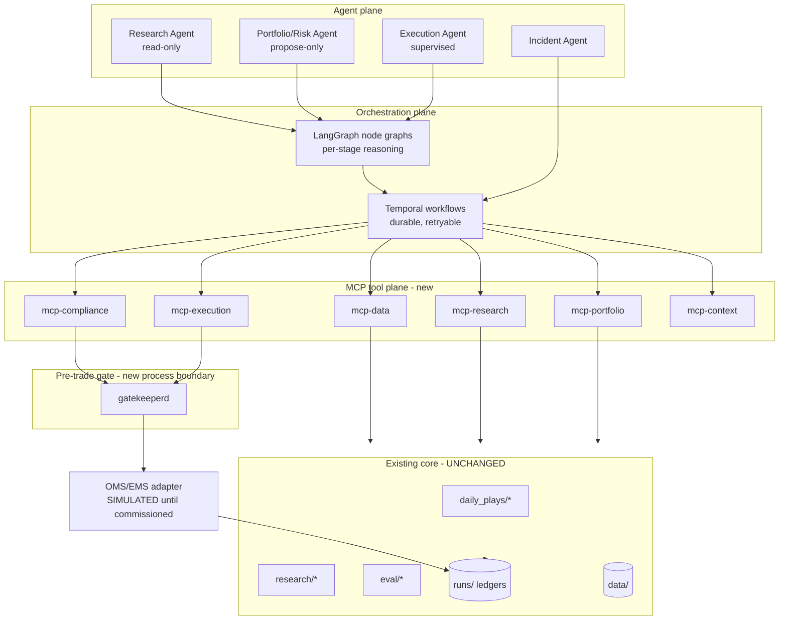
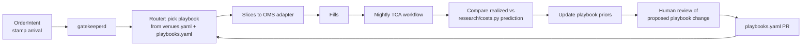

# TradeCentral — Agentic Operating System Upgrade Specification

Status: proposal / technical specification
Target system: **TradeCentral** (repo `edge`) — local-first Vue 3 + Python quantitative
research and decision-support workstation for US equities and options.
Date: 2026-08-21

---

## 0. Premise correction (read first)

The reference architecture this spec responds to assumes an **existing OMS/EMS, factor
risk vendor (MSCI/Axioma), borrow desk, and live execution venues** to be overlaid.
TradeCentral has **none of these today, by explicit design**:

- `docs/ARCHITECTURE.md` §3 lists "a broker OMS/EMS" and "a high-frequency execution
  engine" as **non-goals**.
- `daily_plays/promotion.py::underlying_gate_authorization` hard-returns
  `live_capital_authorized: False` and `broker_connectivity_authorized: False`.
- `daily_plays/options_validation.py::OptionsPolicy.shadow_only` defaults `True`.
- `daily_plays/ledger.py`, `realize.py`, `shadow_lifecycle.py` each carry an explicit
  "nothing in this module talks to a broker" contract in their docstring.

So Principle 1 ("do not replace core legacy engines") inverts here: there is no legacy
execution core to preserve — there is a **deliberate absence** to preserve. This spec
therefore treats Stages 8–10 (Pre-Trade Gate, Execution, TCA) as *designed-and-stubbed
against a simulated venue*, with a single named integration seam
(`edge/execution/oms_client.py`, Protocol-typed) that stays unimplemented until the
operator explicitly commissions a broker. Everything else — Stages 1–7 — is a real
upgrade of code that already exists.

**Assumption stated:** the agentic overlay is built to be execution-ready but ships
shadow-only; Phase 4 (supervised execution) is gated on a separate, explicit human
authorization event that this document specifies but does not grant.

---

## 1. Gap Analysis

### 1.1 What already exists and is genuinely strong

TradeCentral is materially further along the "closed-loop with hard gates" model than a
typical retail or early-stage quant stack. The following are already implemented:

| Lifecycle stage | Existing implementation | Quality |
|---|---|---|
| Point-in-time data | `tools/build_pit_universe.py` (rule-based month-end liquidity membership, explicitly written to kill the 2016-knew-2026 survivorship bug documented in `docs/GATE_XS_RESULT.md`) | Strong |
| Leak-resistant eval | `eval/harness.py` (row `t` derived only from `iloc[t-lb:t]`), `eval/test_no_lookahead.py`, `research/panel_splits.py` (purge/embargo on the trading-date axis, not row positions) | Strong |
| Cost realism | `research/costs.py` (nonlinear impact `η·σ·(Q/ADV)^1.5`), `research/optimizer.py` (L1 trade-cost penalty *inside* the objective), `daily_plays/options_fills.py` (patient-then-cross, always charges the crossed touch) | Strong |
| Preregistered gates | `research/gates.py` (frozen horizons, four hard checks, protocol errors fail the whole call), `docs/GATE_*.md` GO/NO-GO artifacts | Strong |
| Promotion gate | `daily_plays/promotion.py::PromotionPolicy` (frozen thresholds: 120 sessions, 200 trades, ≥2 regimes, ≤50% profit concentration, ECE ≤ 0.05) | Strong |
| Audit ledger | `daily_plays/ledger.py` (immutable per-run dirs + append-only `shadow_decisions.jsonl`, idempotent by deterministic `run_id`), `research/experiment_ledger.py` (hash-chained trial provenance) | Strong |
| Typed contracts | `daily_plays/contracts.py` (`RUN_SCHEMA_VERSION`, `canonical_json`, enum-typed `PlayState`/`RunMode`/`ConfidenceKind`) | Strong |
| Agent-value measurement | `eval/tradelens.py` (PnL decomposition, FF5+Mom attribution, Agent Value Ratio), `research/counterfactual_ledger.py`, `research/agent_gate.py` (`P(ΔPnL_agent > 0 | X_t)` logistic gate) | Strong — **and unusually rare** |
| Risk reconciler | `research/safety.py` (kill switch, circuit breakers, broker-position mismatch halt, drawdown ladder, stale-data halt) | Strong but **unwired** |
| Portfolio limits | `research/portfolio.py::PortfolioLimitsConfig` (position/sector/gross caps, mandatory execution lag) | Adequate |

### 1.2 Gaps against the agentic operating model

**G1 — No MCP surface exists at all.** A repo-wide grep for `fastmcp`, `mcp_server`, or
"model context protocol" returns zero hits. Every capability above is reachable only as a
Python import or as an ad-hoc HTTP route inside a 6,795-line
`tools/api_server.py`. An agent cannot currently call `evaluate_promotion_gate` or
`validate_option_leg` without the orchestrator being a Python process inside this repo.

**G2 — No orchestration runtime.** `.agents/` contains ~90 markdown briefing/handoff
directories from a filesystem-based multi-agent scaffold, but that scaffold orchestrates
**code-writing agents building the dashboard**, not fund operations. There is no
durable-execution engine (Temporal), no graph runtime (LangGraph), no retry/compensation
semantics, and no way for a long-running research task to survive a laptop sleep.

**G3 — Data-quality gates are scattered and advisory.** Staleness/quality checks appear
inline in `daily_plays/opportunity_scanner.py`, `options_board.py`,
`adapters/options.py`, `adapters/internal_models.py`, `contracts.py`, and
`tools/api_server.py` — at least eight independent implementations. There is no single
`data/QUALITY_GATE` that a run must pass before any downstream stage executes, and no
schema registry. `config/upstream_provenance.json` documents *methodological* sources but
not *runtime vendor field maps*.

**G4 — No corporate-actions ledger.** `shadow_lifecycle.py` probes option records for
`split_adjusted`/`adjusted`/`corporate_action_adjusted` flags, i.e. it *trusts the
vendor's adjustment claim*. There is no independent corporate-actions table, so a vendor
that silently re-adjusts history will silently re-write backtests.

**G5 — No commercial-grade factor risk model.** `tools/build_factor_model.py` is a
turnover-reduction study over rev5/mom12_1; `tools/build_finra_factor_model.py` is a
short-interest panel. Neither separates **pure alpha forecast from priced factor
exposure** the way an Axioma/Barra-style model does. Portfolio construction therefore
cannot answer "how much of this position is my forecast vs. an unintended momentum bet?"

**G6 — No pre-trade gate as a *chokepoint*.** `options_validation.py` is fail-closed and
excellent, but it is a *function a caller may choose to call*. Nothing structurally
prevents a future code path from constructing an order without it. There is no restricted
list, no borrow/locate check (the Fintel adapter carries short-interest *analytics*, not
a locate), no PM/CCO sign-off object, and no non-bypassable gate process boundary.

**G7 — No TCA.** `options_fills.py` models *hypothetical* fills conservatively. There is
no arrival-price capture, no realized-slippage record, no venue map, and therefore no
feedback path from realized execution quality into future slicing or routing.

**G8 — No escalation/HITL protocol.** `research/safety.py` can *compute* a halt, but
there is no incident object, no notification transport, no acknowledgement record, and no
"agent pauses and waits for a human" primitive. `daily_plays/monitoring.py` produces
reports; nobody is paged.

**G9 — Context plane is prose, not machine-readable.** `docs/` holds 40+ excellent
markdown documents (`GATE_*.md`, `AUDIT_*.md`, `ARCHITECTURE.md`), but an agent must
read English to learn a limit. Risk limits live as Python dataclass defaults
(`PortfolioLimitsConfig`, `OptionsPolicy`, `PromotionPolicy`) — changing one is a code
change, not a reviewable config change with an approval trail.

**G10 — Single-process, loopback-only, single-operator.** `tools/api_server.py` binds
127.0.0.1 with Clerk verification. Fine for a workstation; it means agents, dashboard,
and research jobs all share one process's failure domain and one auth identity.

---

## 2. Component Integration Plan

### 2.1 Target topology



### 2.2 MCP server inventory

Each server is a thin, typed façade over code that already exists. **No core module is
rewritten.** Servers live in a new `edge/mcp/` package, one module per server, built on
`fastmcp`. All are stdio-transport by default (local-first, no new network surface).

#### `mcp-data` (`edge/mcp/data_server.py`)

| Tool | Wraps | Mutates? |
|---|---|---|
| `resolve_universe(asof, tier)` | `tools/build_pit_universe.py`, `config/universe_*.json` | no |
| `load_bars(symbol, start, end, tier)` | `tools/api_server.py::_load_symbol_bars` (extracted to `edge/data/loaders.py`) | no |
| `data_quality_report(asof, dataset)` | **new** `edge/data/quality.py` (G3 consolidation) | no |
| `corporate_actions(symbol, start, end)` | **new** `edge/data/corporate_actions.py` (G4) | no |
| `vendor_map(dataset)` | **new** `data/vendor_maps/*.yaml` | no |

#### `mcp-research` (`edge/mcp/research_server.py`)

| Tool | Wraps |
|---|---|
| `propose_signal_spec(hypothesis)` | writes `/research/signals/<slug>.yaml`, no compute |
| `register_experiment(spec)` | `research/experiment_ledger.py::register_experiment` |
| `run_walkforward(spec_hash)` | `eval/harness.py` + `research/panel_splits.py` |
| `evaluate_development_gate(evidence)` | `research/gates.py::evaluate_daily_directional_development_gate` |
| `factor_diagnostics(spec_hash)` | `research/factor_diagnostics.py` |
| `cost_curve(symbol, notional)` | `research/costs.py::DynamicCostModel` |
| `agent_value_report(window)` | `eval/tradelens.py` + `research/counterfactual_ledger.py` |

**Hard constraint carried through:** `research/gates.py` takes no path or loader argument
precisely so that evaluating a gate cannot open a sealed holdout. The MCP tool signature
must preserve this — it accepts *evidence*, never a dataset handle. A holdout-opening
tool is deliberately **not exposed over MCP at all**; sealed-holdout evaluation stays a
human-invoked CLI (`python -m edge.research …`) with a one-way ledger entry.

#### `mcp-portfolio` (`edge/mcp/portfolio_server.py`)

| Tool | Wraps |
|---|---|
| `current_exposures()` | `research/portfolio.py` |
| `optimize(alpha_vector, prior_weights, limits_ref)` | `research/optimizer.py` (cost-aware L1) |
| `factor_decompose(weights)` | **new** `edge/research/risk_model.py` (G5) |
| `risk_limits()` | reads `/portfolio/limits.yaml`, not dataclass defaults |
| `capacity_estimate(weights)` | `research/costs.py` impact curve integrated over ADV |

#### `mcp-compliance` (`edge/mcp/compliance_server.py`) — **read-mostly, append-only writes**

| Tool | Backing store |
|---|---|
| `restricted_list(asof)` | `/compliance/restricted_list.yaml` (versioned, PIT) |
| `borrow_availability(symbols)` | `/compliance/borrow/<date>.yaml`; Fintel adapter as *signal*, never as locate |
| `model_inventory()` | `/compliance/models.yaml` (owner, version hash, last gate, expiry) |
| `request_approval(decision_ref, role)` | appends to `/compliance/approvals.jsonl` |
| `approval_status(decision_ref)` | reads same |
| `audit_trail(query)` | unified read over `runs/**/manifest.json` + approvals |

#### `mcp-execution` (`edge/mcp/execution_server.py`)

| Tool | Notes |
|---|---|
| `validate_structure(legs, account)` | `daily_plays/options_validation.py` |
| `estimate_fill(legs, patience)` | `daily_plays/options_fills.py` |
| `submit_order(order, gate_token)` | **requires a gate token; refuses without one** |
| `order_status(order_id)` | |
| `tca_report(window)` | **new** `edge/execution/tca.py` (G7) |
| `venue_map()` | `/execution/venues.yaml` |

#### `mcp-context` (`edge/mcp/context_server.py`)

Serves the Fund-OS file plane (§2.4) as structured reads with schema validation, so an
agent gets `{"max_gross_exposure": 1.0, "source": "portfolio/limits.yaml@v7",
"approved_by": "...", "approved_at": "..."}` rather than a paragraph of markdown.

### 2.3 Orchestration

**Temporal** for durability, **LangGraph** for in-stage reasoning. Split by property:

- **Temporal workflows** own anything that must survive a crash, a laptop sleep, or a
  restart, and anything with a compensation path: the nightly data→research→construction
  →gate→(sim)execution→TCA loop; shadow realization (`daily_plays/realize.py` is already
  idempotent, which makes it a clean Temporal activity); promotion evaluations; incident
  escalation timers.
- **LangGraph graphs** own the bounded reasoning inside a single stage: "draft a signal
  spec from these filings", "explain why this candidate failed the gate", "propose three
  hedges under these limits". Each graph is invoked *as one Temporal activity* so a
  hallucinating loop cannot run unbounded — activity timeout is the circuit breaker.

Workflow definitions land in `edge/orchestration/workflows/`, activities in
`edge/orchestration/activities/`. Activities call MCP tools; they do **not** import
`daily_plays`/`research` directly, so the tool boundary is the only coupling point and
stays auditable.

**Idempotency contract:** every activity is keyed by the deterministic `run_id` scheme
already in `daily_plays/contracts.py`. Replaying a workflow replays into the same
immutable run directory (`ledger.py` already guarantees this) rather than duplicating
ledger lines.

### 2.4 Fund-OS context plane

New top-level `fundos/` directory (kept out of `docs/` so agents never confuse
prose with policy). Every file is YAML with a `schema_version`, validated by
`edge/fundos/schemas/*.json` in CI, and every mutation goes through a PR with a
CODEOWNERS-enforced reviewer.

```text
fundos/
├── data/
│   ├── vendor_maps/{lse,yfinance,fintel,finra,sec,cftc}.yaml
│   ├── corporate_actions/          # PIT, append-only, per-year files
│   ├── universes/                  # pointers to config/universe_*.json + PIT rule
│   └── quality_gates.yaml          # staleness/completeness thresholds (G3)
├── research/
│   ├── signals/<slug>.yaml         # hypothesis, features, horizon, prereg gate ref
│   ├── factors.yaml                # factor definitions for the new risk model
│   └── protocols.yaml              # walk-forward, purge/embargo, trial-count budget
├── portfolio/
│   ├── limits.yaml                 # replaces PortfolioLimitsConfig defaults
│   ├── capacity.yaml               # ADV participation caps by liquidity bucket
│   └── financing.yaml              # borrow cost curves, financing assumptions
├── execution/
│   ├── venues.yaml
│   ├── playbooks.yaml              # slicing strategies by liquidity/urgency
│   └── tca_history/                # daily parquet, feeds §4
└── compliance/
    ├── restricted_list.yaml
    ├── borrow/<date>.yaml
    ├── models.yaml                 # model inventory + expiry
    └── approvals.jsonl             # append-only, hash-chained
```

**Migration rule for existing dataclass defaults:** the frozen dataclasses
(`PromotionPolicy`, `OptionsPolicy`, `PortfolioLimitsConfig`) stay as the *code-level
fallback and type definition*. A loader reads the YAML and constructs the dataclass; if
the YAML is missing, malformed, or fails schema validation, the loader **raises** — it
does not silently fall back to defaults. This preserves the repo's fail-closed idiom
while making limits reviewable.

### 2.5 Agent node inventory

| Agent | Reads | Writes | Can it move capital? |
|---|---|---|---|
| **Research Agent** | mcp-data, mcp-research, mcp-context | `fundos/research/signals/*.yaml` (draft), experiment ledger | No |
| **Portfolio/Risk Agent** | mcp-portfolio, mcp-research, mcp-context | proposed target weights → `runs/proposals/` | No |
| **Compliance Agent** | mcp-compliance, all ledgers | approval *requests* only | No |
| **Execution Agent** | mcp-execution, gate tokens | orders (post-gate only) | Only in Phase 4, supervised |
| **Incident Agent** | `research/safety.py` state, monitoring | incident records, notifications | Can **halt**, never resume |

Asymmetry is deliberate: the Incident Agent can trip a breaker autonomously but cannot
clear one. Resumption is always a human act.

---

## 3. Guardrails & Gatekeeper Design

### 3.1 The pre-trade gate as a process boundary

The core design decision: **the gate is not a function, it is a separate process holding
the only signing key.** This closes G6 structurally rather than by convention.

```text
Execution Agent ──(unsigned OrderIntent)──▶ gatekeeperd ──(signed GateToken)──▶ mcp-execution ──▶ OMS adapter
                                                │
                                                └──▶ /compliance/approvals.jsonl (append-only)
```

- `gatekeeperd` (`edge/gatekeeper/daemon.py`) runs as its own OS process under its own
  user, holding an Ed25519 private key in an OS keychain entry the agent process cannot
  read.
- `mcp-execution.submit_order` verifies the token signature against the **public** key
  and rejects any order whose payload hash differs from the signed hash by even one byte.
- There is no agent-reachable code path to the OMS adapter that does not verify a token.
  Enforced by (a) the OMS client being importable only from `edge/gatekeeper/`, and
  (b) an import-linter contract in CI forbidding `edge.execution.oms_client` imports from
  anywhere else.

### 3.2 Gate check sequence (all hard, all fail-closed, order matters)

```python
# edge/gatekeeper/checks.py — evaluation order is normative
CHECKS = (
    C01_schema_valid,            # OrderIntent parses against frozen schema
    C02_data_freshness,          # every input quote/bar within fundos/data/quality_gates.yaml
    C03_kill_switch_clear,       # research/safety.py: no halt state active
    C04_model_inventory_current, # model version in fundos/compliance/models.yaml, not expired
    C05_gate_evidence_current,   # promotion.py verdict PASS and within validity window
    C06_restricted_list,         # symbol absent from PIT restricted_list.yaml at asof
    C07_borrow_available,        # short side only: locate present in fundos/compliance/borrow/
    C08_position_limits,         # research/portfolio.py: position, sector, gross, net
    C09_capacity,                # participation <= fundos/portfolio/capacity.yaml ADV cap
    C10_structure_valid,         # daily_plays/options_validation.py (spread, OI, DTE, delta)
    C11_risk_budget,             # max_position_risk / max_aggregate_open_risk from OptionsPolicy
    C12_human_signoff,           # required approvals present, unexpired, role-correct
)
```

Semantics, matching the repo's existing idiom in `research/gates.py`:

- **Every check is hard.** No partial credit, no weighted score, no override flag.
- **Any exception is a FAIL**, folded into the same failure class as an explicit reject —
  exactly how `gates.py` folds a `ValueError` back into `finite_complete_inputs = False`.
- **Missing input is a FAIL**, never a skip. An absent borrow file rejects the short.
- The result object records *every* check's verdict, not just the first failure, so the
  audit trail shows what else would have failed.

### 3.3 Human sign-off

```yaml
# fundos/compliance/approval_policy.yaml
rules:
  - match: {new_signal_first_capital: true}
    require: [pm, cco]
    validity_hours: 24
  - match: {gross_exposure_delta_pct: ">5"}
    require: [pm]
    validity_hours: 4
  - match: {symbol_new_to_book: true}
    require: [pm]
    validity_hours: 24
  - match: {vix_level: ">30"}
    require: [pm]
    validity_hours: 1
  - match: {model_version_changed: true}
    require: [pm, cco]
    validity_hours: 24
```

Approval records are append-only and hash-chained (same construction as
`research/experiment_ledger.py`, which already hash-chains trials):

```json
{"schema_version":"fundos-approval-v1","decision_ref":"run_20260821T1400Z_a3f9",
 "payload_hash":"sha256:...","role":"pm","actor":"...","decision":"APPROVE",
 "granted_at":"2026-08-21T14:02:11Z","expires_at":"2026-08-22T14:02:11Z",
 "prev_hash":"sha256:...","entry_hash":"sha256:..."}
```

The approval binds to `payload_hash`. Re-slicing an order after approval invalidates it —
an agent cannot get a small order approved and then submit a large one.

The dashboard gains an **Approvals** route: pending requests, the exact diff being
approved, which checks passed, and a two-action approve/reject. Approval is a human
click in the UI; there is no MCP tool that grants an approval.

### 3.4 Compliance audit logging

One append-only `runs/audit/audit.jsonl`, hash-chained, capturing: every MCP tool call
(name, argument hash, caller identity, duration, result hash), every gate evaluation with
full check vector, every approval event, every incident, and every limit change (git SHA
of the `fundos/` commit). A nightly Temporal workflow verifies chain integrity and files
an incident on any break.

### 3.5 Escalation triggers (agent pauses, human decides)

| Trigger | Source | Agent action | Resume |
|---|---|---|---|
| Kill switch / circuit breaker | `research/safety.py` | Halt all stages | Human only |
| Drawdown ladder breach | `research/safety.py` | Halt new risk, allow reduce-only | Human only |
| Vendor outage / stale data | `fundos/data/quality_gates.yaml` | Halt affected stages, mark degraded (`RunMode.DEGRADED` already exists in `contracts.py`) | Auto on freshness restore + one human ack |
| Borrow recall | `fundos/compliance/borrow/` diff | Halt short side, escalate | Human only |
| Realized vol / VIX regime break | `research/regimes.py`, `research/bocpd.py` | Reduce `risk_scale`, require PM sign-off for new risk | Human only |
| TCA slippage > 3σ vs model | `edge/execution/tca.py` | Halt that venue/playbook | Human only |
| Model inventory expiry | `fundos/compliance/models.yaml` | Refuse orders on that model | Human re-gate |
| Agent value ratio negative | `eval/tradelens.py` AVR | Route to pure-quant path via `research/agent_gate.py` | Auto (this is the designed behavior) |

The last row is worth highlighting: the repo *already* has the mechanism
(`agent_gate.py` evaluating `P(ΔPnL_agent > 0 | X_t)`) to demote the LLM out of the loop
when it is not adding value. That is the single most important guardrail in an agentic
fund stack and it exists here already — it needs wiring, not invention.

---

## 4. Execution Feedback Loop

### 4.1 Schema

Three append-only tables under `fundos/execution/tca_history/`, partitioned by date.

**`order_intents`** — what the system wanted:
```
intent_id (uuid) | run_id | decision_ref | asof_utc | symbol | occ_symbol |
side | quantity | order_type | limit_price | urgency | playbook_id |
alpha_bps_expected | model_version | gate_token_hash | approvals[]
```

**`executions`** — what happened:
```
exec_id | intent_id | venue | slice_seq | arrival_ts | arrival_mid | arrival_bid |
arrival_ask | submit_ts | fill_ts | fill_price | fill_qty | commission |
fees | cancelled_qty | reject_reason | quote_age_ms
```

**`tca_daily`** — derived, one row per intent:
```
intent_id | implementation_shortfall_bps | vs_arrival_bps | vs_vwap_bps |
vs_close_bps | spread_capture_pct | realized_impact_bps | predicted_impact_bps |
impact_residual_bps | delay_cost_bps | opportunity_cost_bps | fill_rate |
playbook_id | venue | adv_participation_pct | regime_vol | regime_trend
```

`arrival_mid` is captured **at intent creation, before any routing decision** — the whole
measurement is worthless if arrival is stamped after the agent has already moved.

### 4.2 Workflow



### 4.3 The learning step, and its deliberate limit

The feedback loop updates **two** things, and only these two:

1. **`research/costs.py` impact calibration.** The model is
   `Impact = η·σ·(|Q|/ADV)^1.5`. Nightly, fit `η` per liquidity bucket by regressing
   `realized_impact_bps` on `σ·(Q/ADV)^1.5`. Update `η` only when the new estimate's
   bootstrap CI excludes the current value **and** ≥ 60 executions back it. This directly
   improves `research/optimizer.py`, whose objective already contains the cost term — so
   better cost estimates immediately produce better *portfolios*, not just better routing.

2. **Playbook selection priors.** Per `(liquidity_bucket, urgency, regime)` cell, maintain
   a posterior over `implementation_shortfall_bps` by playbook. The router picks the
   posterior-best playbook, with an ε-greedy exploration floor so a playbook that was
   unlucky early is not permanently starved.

**Deliberate limit — no closed-loop alpha learning.** Realized PnL does **not** feed back
into signal weights automatically. That path is how a system overfits to its own recent
luck, and it is exactly what the repo's gate architecture exists to prevent
(`docs/GATE_XS_RESULT.md`: universe construction moved results more than the model did).
Alpha changes go through `research/gates.py` and `promotion.py` with fresh
preregistration. The execution loop learns **costs and mechanics**; only humans plus
preregistered gates change **what the system believes**.

### 4.4 Shadow-mode operation of the same loop

Until Phase 4, `executions` is populated by `daily_plays/options_fills.py` under the
patient-then-cross model rather than by a venue. Every schema, workflow, and TCA
computation above runs identically. Consequence: the day a broker is commissioned, the
TCA plumbing has months of shadow history and known-good code paths — the change is the
data source, not the architecture.

---

## 5. Phased Rollout

Each phase has a completion bar that is a **recorded artifact**, matching the repo's
existing `docs/GATE_*.md` convention.

### Phase 0 — Foundations (2–3 weeks) · Risk: none

- Create `fundos/` tree, schemas, CI validation, CODEOWNERS.
- Consolidate G3: single `edge/data/quality.py`, all eight inline checkers delegate to it.
- Build `edge/data/corporate_actions.py` (G4) with an independent actions table.
- Extract loaders out of `tools/api_server.py` into `edge/data/loaders.py`.
- Stand up `runs/audit/audit.jsonl` with chain verification.

**Bar:** every existing test still green; `fundos/` schema CI passes; one full nightly run
produces a complete audit chain. **No agent exists yet.**

### Phase 1 — Read-only Research Agent (3–4 weeks) · Risk: low

- Ship `mcp-data`, `mcp-research`, `mcp-context` (read tools only).
- LangGraph research graph: ingest filings/news → draft signal spec →
  register experiment → run walk-forward → report.
- Agent writes **only** to `fundos/research/signals/*.yaml` as drafts and to the
  experiment ledger. Sealed holdout remains human-CLI-only.
- Instrument `eval/tradelens.py` AVR from day one — measure the agent's value before
  trusting it.

**Bar:** `docs/GATE_AGENT_RESEARCH.md` — ≥ 20 agent-drafted specs, ≥ 1 passing
`research/gates.py` development gate, zero holdout touches in the audit log, AVR computed.

### Phase 2 — Portfolio & Risk Assistant (4–6 weeks) · Risk: low-moderate

- Ship `mcp-portfolio`; build `edge/research/risk_model.py` (G5) — a real factor
  decomposition separating forecast from priced exposure.
- Migrate `PortfolioLimitsConfig`/`OptionsPolicy`/`PromotionPolicy` defaults into
  `fundos/portfolio/limits.yaml` behind the raise-on-invalid loader.
- Portfolio Agent proposes target weights to `runs/proposals/`; dashboard renders
  proposal vs. current with factor attribution. **Proposals are never executed.**
- Temporal owns the nightly loop end-to-end.

**Bar:** `docs/GATE_AGENT_PORTFOLIO.md` — 60 sessions of proposals, factor
decomposition reconciles to portfolio return within tolerance, zero limit breaches in
proposals, workflow survives an induced crash mid-run with correct replay.

### Phase 3 — Gatekeeper + Shadow Execution (4–6 weeks) · Risk: moderate

- Build `gatekeeperd` as a separate signing process; implement all twelve checks.
- Ship `mcp-compliance` and `mcp-execution` with the **simulated** OMS adapter.
- Populate `fundos/compliance/` — restricted list, borrow, model inventory.
- Full TCA schema live against simulated fills.
- Dashboard Approvals route; PM/CCO sign-off flow exercised for real on shadow orders.
- Incident Agent + escalation matrix live, including a real notification transport.

**Bar:** `docs/GATE_PRETRADE.md` — adversarial test suite proving no order reaches the
OMS adapter without a valid token (including deliberate bypass attempts in CI);
import-linter contract enforced; 90 sessions of shadow orders each with a complete
`(intent → gate vector → approvals → executions → tca_daily)` chain; ≥ 1 rehearsed
incident with human ack and resume recorded.

### Phase 4 — Supervised Execution Overlay · Risk: high · **Requires explicit operator authorization**

Not scheduled by this document. Preconditions, all of which must hold simultaneously:

1. `daily_plays/promotion.py::evaluate_promotion_gate` returns PASS against the frozen
   `PromotionPolicy` (120 sessions, 200 trades, ≥ 2 regimes, ≤ 50% concentration,
   ECE ≤ 0.05, drawdown ≤ 8%).
2. Phase 3 gate artifact recorded and clean.
3. TCA shadow-vs-realized reconciliation on a paper account for ≥ 30 sessions.
4. A signed, dated operator authorization changing `shadow_only: True` → `False` in
   `fundos/execution/` — a reviewed config change with an approval-ledger entry, never a
   code default flip.
5. Every order is PM-approved individually for the first 30 sessions; autonomy expands
   only per-bucket, per-notional, with a recorded decision at each step.

Rollback for every phase: `fundos/` is git-versioned and the MCP servers are additive —
reverting a commit and stopping the daemons returns the system to its current behavior,
because no core module was modified.

---

## 6. Summary of new artifacts

| Path | Purpose |
|---|---|
| `fundos/**` | Machine-readable context plane (G9) |
| `edge/mcp/{data,research,portfolio,compliance,execution,context}_server.py` | MCP tool plane (G1) |
| `edge/orchestration/{workflows,activities}/` | Temporal + LangGraph (G2) |
| `edge/data/quality.py` | Consolidated data-quality gate (G3) |
| `edge/data/corporate_actions.py` | Independent actions ledger (G4) |
| `edge/research/risk_model.py` | Factor decomposition (G5) |
| `edge/gatekeeper/{daemon,checks}.py` | Pre-trade gate process (G6) |
| `edge/execution/{oms_client,tca,router}.py` | Execution seam + TCA (G7) |
| `edge/incident/` | Escalation and HITL primitives (G8) |
| `runs/audit/audit.jsonl` | Unified hash-chained audit trail |
| `dashboard/src/views/ApprovalsView.vue` | Human sign-off surface |

**Files modified in `daily_plays/`, `research/`, `eval/`: none required.** The overlay is
additive by construction; the only changes to existing code are (a) extracting loaders
out of `tools/api_server.py`, (b) redirecting eight inline quality checks to the shared
module, and (c) sourcing three dataclasses from YAML via a raise-on-invalid loader.
