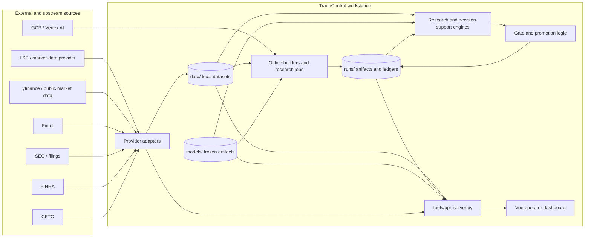
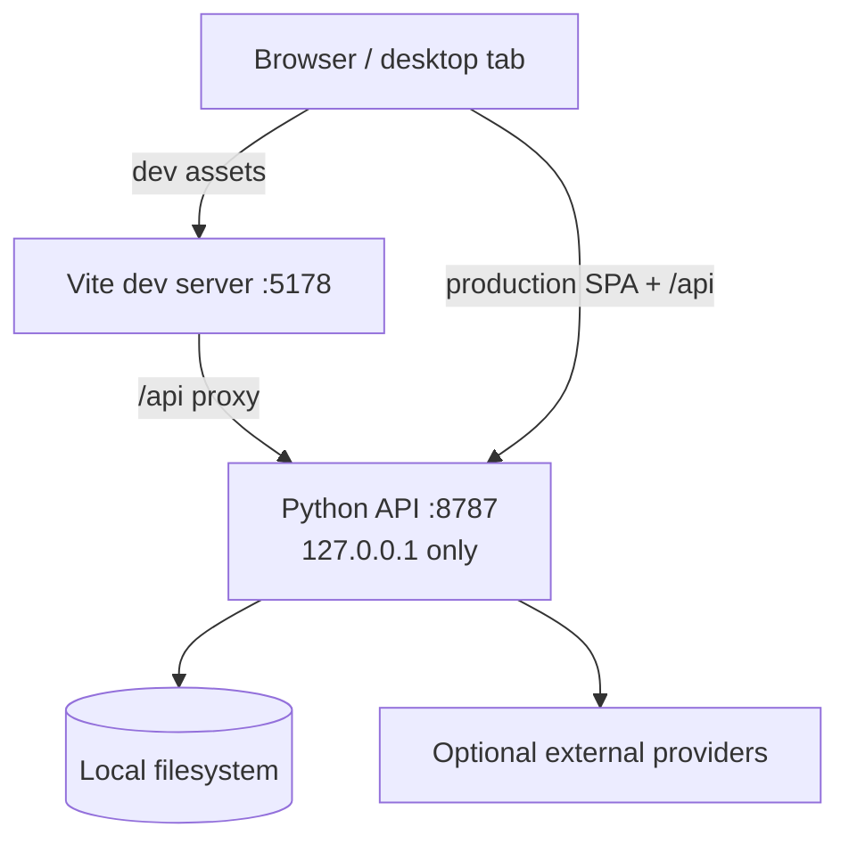
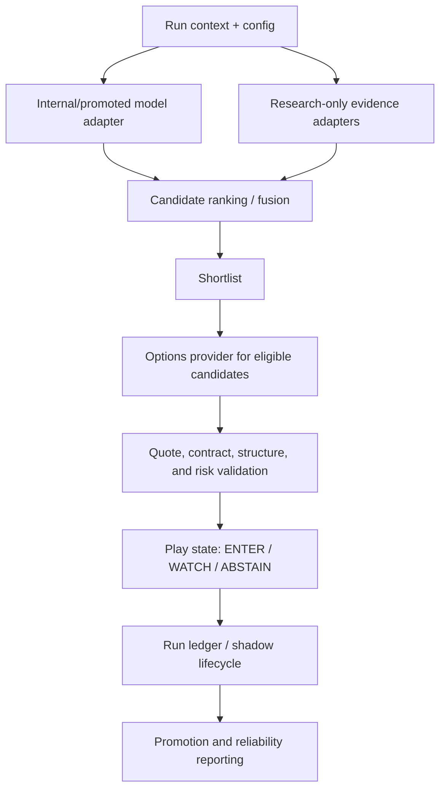
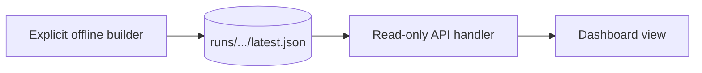

# TradeCentral System Architecture

Status: living architecture specification  
Audience: maintainers, reviewers, research engineers, and future contributors

## 1. Purpose

TradeCentral is a local-first quantitative research and market decision-support system. It combines historical and near-live market data, model/research artifacts, options intelligence, flow diagnostics, preregistered gates, and a desktop-oriented operator dashboard.

This document describes the architecture that exists in the repository today. It is intentionally separate from strategy result documents: architecture should remain stable while individual models, gates, and research outcomes change.

## 2. Architectural goals

The system is built around seven constraints.

1. **Research must remain auditable.** Model claims need reproducible inputs, point-in-time evaluation, recorded gates, and durable artifacts.
2. **The operator surface must fail visibly.** Missing or stale data cannot be silently presented as zero or current.
3. **External provider shapes must not leak into core logic.** Provider-specific normalization happens at adapter boundaries.
4. **Expensive research work should not happen because a page refreshed.** Heavy diagnostics are normally built offline and served as artifacts.
5. **Decision support must remain separate from execution.** The core pipeline creates research/play records and validation state; it does not submit broker orders.
6. **The local workstation is the primary deployment target.** The API binds to loopback and the dashboard is optimized for a single operator.
7. **Promotion must fail closed.** A model or candidate is not made live by UI state, optimistic metadata, or the presence of a score.

## 3. Non-goals

The current repository is not designed as:

- a public multi-tenant SaaS application;
- a broker OMS/EMS;
- a high-frequency execution engine;
- a low-latency market-data bus;
- a general-purpose data warehouse;
- a source of guaranteed trading recommendations;
- a distributed microservice platform.

These are important boundaries. The system can evolve, but those capabilities should not be implied by the current architecture.

## 4. Product name versus internal namespace

The repository/product is **TradeCentral**. The runtime and Python/filesystem namespace is still **`edge`**.

A number of scripts compute the workspace root and then expect this repository at `<workspace>/edge`. For example, the API server derives `EDGE_DIR = ROOT / "edge"`, and the dashboard launcher changes to the workspace root before invoking `edge/...` paths.

Therefore the supported checkout shape today is:

```text
<workspace>/
└── edge/                   # this repository
    ├── dashboard/
    ├── daily_plays/
    ├── research/
    ├── tools/
    └── ...
```

A future namespace migration from `edge` to `tradecentral` should be treated as an explicit refactor with import, path, script, artifact, and documentation migration. It should not be performed piecemeal.

## 5. System context



The important architectural split is between **computation** and **presentation**. The dashboard is not the research engine. It is a typed client over a local API that reads data, loads artifacts, and invokes only the explicitly supported live/near-live computations.

## 6. Runtime topology

TradeCentral currently runs as a small local stack.



### Development mode

- Vite serves the frontend on `127.0.0.1:5178`.
- `/api` requests proxy to the Python server on `127.0.0.1:8787`.
- Frontend changes hot reload.

### Built mode

- Vite compiles into `runs/dashboard_dist/`.
- `tools/api_server.py` serves both the static SPA and `/api/*` routes from port `8787`.
- Extension-less routes fall back to `index.html` for Vue Router history mode.

The launcher is `tools/run_dashboard.sh` and is the supported operator entry point.

## 7. Major modules and ownership

| Path | Responsibility | Architectural rule |
|---|---|---|
| `config/` | Frozen universes and policy | Configuration is versioned and reviewable |
| `daily_plays/` | Decision-support pipeline | No broker order routing; fail closed |
| `dashboard/` | Operator UI | Presentation and interaction only |
| `eval/` | Leak-resistant evaluation | Point-in-time causality is load-bearing |
| `models/` | Frozen/versioned model artifacts | Artifacts must be traceable to evaluation evidence |
| `research/` | Offline research primitives | No hidden live execution side effects |
| `tools/` | Data builders, API, diagnostics, launchers | Explicit operational boundaries |
| `data/` | Local source/cache datasets | Regenerable; not committed |
| `runs/` | Computed artifacts and ledgers | Runtime/research evidence; not source code |
| `docs/` | Gates, runbooks, results, architecture | Decision record and operating contract |

## 8. Frontend architecture

The frontend is a Vue 3 single-page application written in TypeScript.

### 8.1 Shell

`dashboard/src/App.vue` owns cross-workspace state that every view needs:

- dashboard status;
- readiness state;
- market clock;
- primary and secondary navigation;
- keyboard search;
- density preference;
- shell-level warnings and market-state indicators.

Shared resources are polled once in the shell and provided to child views. This avoids multiple routes independently opening identical pollers.

### 8.2 Routing

`dashboard/src/router.ts` is the route source of truth. The current primary/specialist route set includes:

- Desk
- Market
- Sectors
- Pulse / Sentiment
- Options
- Flow
- Gates
- Cloud
- Evolution
- Research
- Graph
- Live Blend
- Fintel
- Breaks / Changepoints
- Momentum

Legacy paths such as `/anomalies` and `/flow-state` redirect into the newer consolidated route structure.

### 8.3 API client

`dashboard/src/api.ts` is the typed boundary between Vue and the Python backend.

All HTTP calls should flow through the shared request helper so that:

- unreachable backend state becomes an explicit typed error;
- view code does not duplicate fetch behavior;
- payload normalization is centralized;
- stale/error treatment is consistent.

### 8.4 Resource polling

`dashboard/src/composables/useResource.ts` implements the reusable polling model.

The key operator rule is: **a failed refresh should preserve the last known good value while making its stale/error state visible**. Blank replacement data can be more dangerous than an obviously stale value because it destroys context and may be misread as a valid zero.

### 8.5 Visualization

Most charts use dependency-light SVG primitives under `dashboard/src/charts/`:

- scales;
- path generation;
- returns/risk statistics;
- deterministic rendering helpers.

Three.js is available only for surfaces that genuinely require 3D rendering. Basic market plots should remain SVG/CSS so visual semantics stay tied to the design tokens.

## 9. Backend architecture

`tools/api_server.py` is a local threaded JSON/static server built on Python's standard-library HTTP server stack, with project numerical dependencies loaded as needed.

### 9.1 Why a local API exists

The API creates a clean boundary between the frontend and the research workspace:

- Vue never reads Python files or Parquet directly;
- provider credentials stay out of browser code;
- artifact interpretation is centralized;
- expensive computations can be cached or moved offline;
- the same backend can expose explicit health/readiness semantics.

### 9.2 Endpoint families

The API surface is broad but can be grouped into stable domains.

#### System and operator state

- `/api/health`
- `/api/status`
- `/api/readiness`
- `/api/market-clock`
- `/api/gates`
- `/api/gcp`

#### Symbol and market research

- `/api/search`
- `/api/analyze`
- `/api/trajectory`
- `/api/compare`
- `/api/sentiment`
- `/api/anomalies`
- `/api/momentum-scan`
- `/api/adaptive-signal`

#### Options and flow

- `/api/options`
- `/api/options/backfill_oi`
- `/api/unusual-flow`
- flow-state artifacts
- options-board and related option intelligence helpers

#### Research artifacts

- `/api/ga`
- `/api/graph`
- `/api/factors`
- `/api/changepoints`
- `/api/flow-state`

#### Provider-specific intelligence

- `/api/fintel/status`
- `/api/fintel/stream`
- `/api/fintel/intel`
- `/api/fintel/search`

The exact endpoint list in `tools/api_server.py` remains the implementation source of truth.

### 9.3 Handler failure isolation

Handlers are expected to convert exceptions into structured HTTP 500 responses and log tracebacks without terminating the whole process. A malformed artifact or one bad symbol must not kill the operator API.

This is appropriate for a workstation process where continuity of the remaining views is more useful than process-wide failure.

## 10. Data architecture

TradeCentral is filesystem-first.

### 10.1 `data/`

`data/` stores local market and provider-derived datasets such as:

- daily OHLCV universes;
- intraday bars where available;
- small-cap universe data;
- options-chain/OI captures;
- provider caches.

These files are considered local/regenerable and are excluded from Git.

### 10.2 `runs/`

`runs/` stores outputs produced by tools and experiments, including examples such as:

- compiled dashboard assets;
- knowledge graph artifacts;
- factor diagnostics;
- changepoint artifacts;
- flow-state artifacts;
- GA runs;
- shadow logs and realized outcomes;
- other experiment/run manifests.

The important contract is that an artifact is either available with provenance or explicitly unavailable. The API should not invent a replacement result simply because the frontend requested it.

### 10.3 `models/`

`models/` contains versioned research/model artifacts used by the evaluation or scoring paths. Model files should be treated as immutable evidence once a gate/result references their identity or hash.

### 10.4 `docs/`

`docs/` contains the human-readable decision record: preregistered gates, results, audits, runbooks, plans, and architecture/design specifications.

A result document is historical evidence, not automatically the current operating state.

## 11. Research architecture

The research layer is deliberately separate from the dashboard.

### 11.1 Evaluation harness

`eval/` provides the shared leak-resistant evaluation path. Its contract is that features for target time `t` are derived only from data available before the target row. Property tests exist specifically to prevent lookahead regressions.

### 11.2 Research primitives

`research/` contains components for:

- point-in-time data loading;
- features and labels;
- cross-sectional/panel splits;
- regimes;
- evaluation statistics;
- cost accounting;
- portfolio simulation;
- robustness checks;
- gates;
- experiment ledgers;
- frozen artifact scoring;
- research challengers;
- specialized experiments such as GEX, changepoints, and GA work.

The architectural intent is reproducibility before complexity. A model should not receive promotion because it is more sophisticated; it should receive promotion only when it survives the relevant evidence protocol.

## 12. Decision-support pipeline

`daily_plays/pipeline.py` is a dependency-injected pipeline for candidate and options decision support.



### 12.1 Adapter boundary

Provider and upstream model integrations live behind adapters. Examples include:

- internal models;
- promoted model manifests;
- frozen directional research;
- Kronos research evidence;
- live flow;
- options snapshots;
- sector-flow discovery;
- Fintel/provider-specific intelligence in the API layer.

Core pipeline logic consumes normalized mappings/contracts, not raw provider payloads.

### 12.2 Research evidence versus decision evidence

Research evidence may improve operator context but must not silently alter the semantic meaning of a calibrated model probability.

This is particularly important when mixing:

- ordinal scores;
- heuristic flow ranks;
- research-only challenger outputs;
- calibrated probabilities;
- live execution checks.

The fusion layer ranks evidence; it is not allowed to pretend every input is a probability.

### 12.3 Options validation

Options tickets are subject to explicit validation including, where applicable:

- quote freshness;
- market session;
- DTE range;
- bid/ask spread;
- open interest;
- volume;
- delta range;
- option structure validity;
- maximum loss;
- account/underlier/aggregate risk limits;
- degraded-provider state.

Failure should result in WATCH/ABSTAIN or an explicit rejection reason rather than a fabricated valid ticket.

### 12.4 Shadow lifecycle

The shadow layer records hypothetical decisions and later realizes outcomes without broker execution. Promotion/reporting logic operates on recorded evidence and is separate from the browser's visual readiness state.

## 13. Gates and authorization

TradeCentral has multiple evidence layers and they should not be conflated.

### 13.1 Research gates

Preregistered model/strategy gates define quantitative acceptance criteria before the corresponding evaluation is inspected. Their artifacts live under `docs/` and/or `runs/`.

### 13.2 Dashboard readiness

The dashboard exposes an operator-facing readiness interlock from `/api/readiness`. It summarizes gate and shadow state for the UI.

That interlock is **not** a universal production authorization mechanism. Individual pipelines may have stricter promotion rules and larger evidence requirements.

### 13.3 Execution authorization

The checked-in decision-support pipeline does not implement broker order routing. Even a passing research/promotion gate does not magically create broker connectivity.

## 14. Offline artifact contract

Some dashboard surfaces intentionally never compute heavy research on request.

Examples include the knowledge graph and factor diagnostics, and the cross-sectional form of changepoint/flow-state research. Their supported flow is:



This contract protects the workstation from accidental recomputation storms caused by polling, route changes, or browser refreshes.

If the artifact does not exist, the correct result is `available: false` with a reason and, ideally, the command needed to generate it.

## 15. Caching and freshness

The API uses targeted in-process caches for expensive or quota-sensitive operations.

Current examples include:

- Fintel market-stream and symbol intelligence caches;
- stream hit-rate caches;
- options-board caches;
- other endpoint-specific memoization where data cost justifies it.

Caching policy should always specify:

1. what is cached;
2. the TTL;
3. the source timestamp carried in the payload;
4. whether stale data may be served;
5. how a write/backfill invalidates related caches.

A cache TTL is not a provenance timestamp. The UI should display source/as-of state from the payload, not infer freshness from request time.

## 16. Time and market-session architecture

`daily_plays/clock.py` and the API market-clock endpoint centralize session logic.

The authoritative path uses exchange-calendar data for XNYS so the system accounts for:

- holidays;
- early closes;
- daylight-saving transitions;
- premarket, regular, after-hours, and closed states.

Weekday arithmetic is not considered sufficient for trading-session authorization.

The UI separately shows UTC wall-clock time because provider and multi-venue timestamps should be compared in an unambiguous timezone.

## 17. Security and trust boundaries

### 17.1 Loopback-only server

The API binds to `127.0.0.1`. This is a security requirement under the current architecture because:

- there is no user authentication layer;
- provider credentials may be available to the backend process;
- some endpoints can trigger data capture or scans;
- the system contains sensitive research and local artifacts.

Do not expose port `8787` directly to a public network.

### 17.2 Secrets

Secrets belong in `.env` or provider-native local credential stores and are excluded from Git.

The browser should never receive raw provider keys. Status endpoints may report that a provider is configured, but not the key value.

### 17.3 File serving

Static serving must reject path traversal outside the configured serving root. The API server already treats this as an explicit boundary.

### 17.4 External payloads

All external payloads are untrusted input. Adapters should normalize, validate, and mark missing/invalid fields before those values reach ranking or presentation logic.

## 18. Reliability and failure behavior

The system favors degraded continuity over silent correctness failures.

Expected behavior includes:

- one endpoint exception does not kill the process;
- one symbol failure does not invalidate unrelated symbols;
- last good frontend data can remain visible with a stale/error marker;
- missing data renders as unavailable rather than zero;
- missing offline artifacts produce an explicit empty state;
- unavailable providers reduce capability rather than fabricate replacements;
- promotion logic fails closed.

This philosophy is especially important for financial interfaces, where a plausible-looking incorrect value is often more dangerous than an obvious error.

## 19. Testing strategy

Testing is split by architectural responsibility.

### Frontend

- Vitest for chart/statistical utilities and frontend logic
- `vue-tsc --noEmit` as part of the production build
- Vite build as an integration check

### Evaluation

- property tests for no-lookahead behavior under `eval/`
- research-specific tests for split, gate, cost, and scoring logic

### Decision support

- adapter normalization tests;
- canonical contract tests;
- options validation tests;
- promotion/shadow lifecycle tests;
- fixture-driven pipeline tests.

### Operational preflight

- environment drift/preflight tools;
- API health route;
- launcher stale-process checks;
- artifact availability checks.

A successful frontend build proves only that the UI compiles. It is not a model validation result.

## 20. Deployment model

The supported deployment today is a single research workstation.

### Operator process

1. Local datasets/artifacts exist or are generated explicitly.
2. `tools/run_dashboard.sh` starts/builds the frontend.
3. `tools/api_server.py` serves the API and, in built mode, the SPA.
4. The browser connects only to localhost.

### Cloud model research

Cloud/Vertex tooling is isolated from the operator runtime. `requirements-vertex.txt` exists to pin the training environment separately from dashboard/operator packages.

This separation reduces the chance that adding an operational package changes a previously reproducible model environment.

## 21. Known architectural debt

The current architecture is intentionally pragmatic. The following items are debt, not hidden features.

### 21.1 `edge` path coupling

Scripts assume a workspace folder named `edge`. This makes a default `git clone ... tradecentral` checkout surprising.

Recommended future fix: introduce a package-level root resolver and remove hard-coded workspace-folder assumptions before renaming the namespace.

### 21.2 Monolithic local API module

`tools/api_server.py` owns many endpoint families. This is acceptable for a single-user local process but makes ownership and testing harder as the feature set grows.

Recommended future fix: split handlers into domain modules while keeping one local process and one shared response/error contract.

### 21.3 Filesystem artifact index

The filesystem is simple and auditable, but discovery/version lookup becomes harder as experiments accumulate.

Recommended future fix: add a lightweight artifact manifest/index before considering a database. Preserve immutable file artifacts as the evidence layer.

### 21.4 Mixed live and offline responsibilities

The API both reads offline artifacts and performs selected live/near-live computations.

Recommended future fix: define endpoint classes explicitly (`artifact`, `cached-provider`, `live-compute`, `mutation/backfill`) and enforce different cache/time-budget rules for each.

### 21.5 Contract drift risk

Python payloads and TypeScript interfaces can drift because there is no generated cross-language schema.

Recommended future fix: introduce JSON Schema/OpenAPI or another generated contract layer once the endpoint surface stabilizes.

## 22. Evolution path

A sensible next architecture remains local-first and incremental:

1. Extract API domain modules without changing behavior.
2. Add explicit response schemas and contract tests.
3. Add artifact manifests with producer version, source hashes, as-of timestamps, and schema version.
4. Centralize provider/cache policies.
5. Formalize endpoint budgets and background/offline-only computation rules.
6. Refactor the `edge` namespace/path assumption.
7. Only then consider a multi-user authenticated service if there is a concrete need.

Do not introduce distributed infrastructure simply because the feature count grows. The current system benefits from low operational overhead, inspectable files, and a short path from research artifact to operator view.

## 23. Architecture decision rules

New code should satisfy the following questions before merge:

- Is this research, live data acquisition, decision support, presentation, or execution?
- Which module owns it?
- What is the source-of-truth timestamp?
- Can the value be unavailable, stale, proxy, or degraded?
- Does the payload preserve that state explicitly?
- Is the computation safe to run on a UI poll?
- If not, what offline builder produces the artifact?
- Does any provider-specific structure escape its adapter?
- Does the change alter a promotion or capital-authorization path?
- Is there a test that would fail if lookahead, stale-data masking, or semantic probability drift were introduced?

If those questions are unclear, the feature boundary is not ready.
