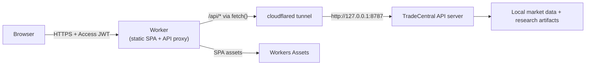

# Cloudflare deployment

TradeCentral runs the Python API and the Vue SPA from one Python process. That
process cannot execute on Cloudflare Workers or Pages (pandas, local parquet
files, threaded scan jobs), so the supported Cloudflare shape uses three pieces:

- **Cloudflare Worker** (`tradecentral.syriltj1.workers.dev`) serves the built
  SPA as static assets and proxies `/api/*` to the tunnel origin.
- **Cloudflare Tunnel** exposes the local `api_server.py` (bound to
  `127.0.0.1`) without opening any firewall port.
- **Cloudflare Access** (Zero Trust) authenticates the browser at the edge and
  restricts the Worker hostname to specific email addresses — the operator's
  Cloudflare account email for a single-operator deployment.

## Architecture



The Python process stays bound to loopback. It never sees unauthenticated
traffic because only `cloudflared` can reach it, and Cloudflare's edge enforces
the Access policy before any request reaches the Worker.

## Files

| File | Purpose |
|------|---------|
| `cloudflare/wrangler.toml` | Worker config — static assets binding, API proxy variable |
| `cloudflare/worker.js` | Worker entry point — SPA serving + `/api/*` reverse proxy |
| `cloudflare/setup_tunnel.sh` | Creates the tunnel, routes DNS, writes cloudflared config |
| `cloudflare/.env.cloudflare` | Environment template for the local API server |

## Setup

### 1. Deployed state

The Worker is already live at `https://tradecentral.syriltj1.workers.dev` with
Access gating confirmed (unauthenticated requests return a 302 to
`syriltj1.cloudflareaccess.com`). What remains is wiring the API behind it.

### 2. Set up the tunnel

```bash
brew install cloudflared
cloudflared tunnel login
bash cloudflare/setup_tunnel.sh tradecentral-api.syriltj1.workers.dev 8787
```

The API tunnel hostname can be a separate workers.dev subdomain or any domain
routed through your Cloudflare account. The setup script creates the tunnel,
adds DNS, writes `~/.cloudflared/config.yml`, and starts the tunnel.

### 3. Point the Worker at the tunnel

Edit `cloudflare/wrangler.toml` and set `API_UPSTREAM` to the tunnel hostname
from step 2, then redeploy:

```bash
API_UPSTREAM="tradecentral-api.syriltj1.workers.dev"
sed -i '' "s|API_UPSTREAM = \"\"|API_UPSTREAM = \"${API_UPSTREAM}\"|" cloudflare/wrangler.toml
cd dashboard && npm run build && cd ..
npx wrangler deploy -c cloudflare/wrangler.toml
```

### 4. Configure the API server

Copy the environment template and start the server:

```bash
cp cloudflare/.env.cloudflare .env.cloudflare
set -a; source .env.cloudflare; set +a
bash tools/run_dashboard.sh --serve
```

The critical settings:

| Variable | Value | Why |
|----------|-------|-----|
| `EDGE_HOST` | `127.0.0.1` | Server stays loopback — only cloudflared reaches it |
| `EDGE_AUTH_MODE` | `local` | Access at the edge is the gate; no Clerk JWT needed |
| `EDGE_CORS_ORIGINS` | `https://tradecentral.syriltj1.workers.dev` | POST endpoints and preflight are not CSRF-blocked through the Worker |
| `EDGE_REQUIRE_AUTH` | `0` | Server is loopback-only; auth is enforced by Access |

### 5. Verify

1. Open `https://tradecentral.syriltj1.workers.dev` in a browser — you should
   see the Access login, then the dashboard after authenticating.
2. Confirm `/api/health` returns `{"status": "ok"}` through the same origin.
3. Confirm a POST endpoint (e.g. trigger a quick scan) succeeds without a
   cross-site-write error.

## Security notes

- The Python server binds to `127.0.0.1`. It is unreachable from the network
  even if the tunnel is down or misconfigured.
- Cloudflare Access verifies the operator identity at the edge. The Worker and
  the Python server do not re-verify the Access JWT (the tunnel is the only
  path to the server), which is the same trust boundary as a loopback-only
  deployment.
- Mutating endpoints (`/api/trigger_scan`, `/api/plays/run`,
  `/api/options/backfill_oi`, `/api/vpa/analyze`) check the `Origin` header
  against `EDGE_CORS_ORIGINS` to block cross-site writes. The Worker hostname
  must be allowlisted for POST to work through the proxy.
- Provider credentials stay in the local `.env` and are never exposed to the
  browser or Cloudflare.
