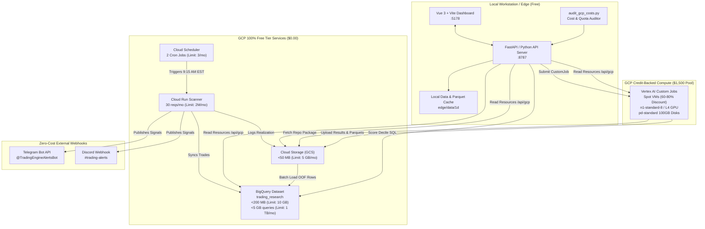
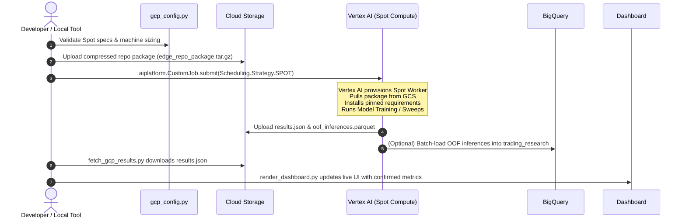
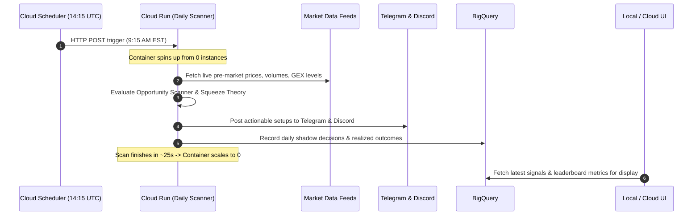

# Google Cloud Platform (GCP) Services & Cost-Optimization Architecture Guide

## 1. Overview & High-Level Architecture

Our trading system leverages a **hybrid-cloud edge architecture**:
- **Local Mac / Edge Workstation**: Runs the real-time API server (`api_server.py`), interactive Vue 3 dashboard, and local backtests.
- **Google Cloud Platform (GCP)**: Handles automated pre-market serverless scans, distributed model training sweeps, multi-year walk-forward validations, artifact archiving, and high-speed BigQuery analytical queries.

### Architecture Topology



---

## 2. GCP Services Breakdown: Why, How, and What They Touch

### 1. Vertex AI (Custom Training Jobs)
- **Role in Architecture**: Heavy distributed model training, hyperparameter sweeps, and out-of-sample cross-validation.
- **Why We Use It**:
  - Training LightGBM Alpha158 cross-sectional rankers across 550+ stocks, fine-tuning Kronos Transformer neural nets on GPUs, and running multi-year walk-forward backtests takes heavy compute.
  - Running on Vertex AI allows parallel multi-core execution in the cloud while keeping local machines responsive.
- **What It Touches & Interacts With**:
  - **Inputs**: Pulls compressed repository packages (`gs://edge-artifacts-.../packages/*.tar.gz`) from GCS containing model definitions, historical 1D price data, and configs.
  - **Environment**: Executes inside Google-managed pre-built containers (`us-docker.pkg.dev/vertex-ai/training/tf-cpu.2-12.py310:latest` for CPU or PyTorch for GPU) with pinned dependency layers.
  - **Outputs**: Writes evaluation metrics (`results.json`), daily returns (`daily_portfolio_returns.parquet`), and out-of-fold predictions (`oof_inferences.parquet`) directly back to GCS and triggers batch loading into BigQuery.
- **Cost Guardrails & Optimization**:
  - **Spot VM Provisioning**: Strictly passes `scheduling_strategy=Scheduling.Strategy.SPOT` to `job.submit()` and `job.run()`. This captures a **60% to 80% discount** compared to standard on-demand compute.
  - **Right-Sized Standard Disks**: Uses `pd-standard` 100GB disks ($0.04/GB/mo billed only during active job runtime) instead of expensive `pd-ssd` 200GB disks ($0.17/GB/mo), cutting disk fees by **~85%**.
  - **Hard Execution Timeouts**: Enforces hard caps (`timeout=3600s` or `7200s`) preventing runaway jobs.
  - **Billing Routing**: Billed 100% against the active **$1,500 GenAI Credit Pool** ($0.00 out-of-pocket).

---

### 2. Google Cloud Storage (GCS)
- **Role in Architecture**: Cloud artifact store and model registry.
- **Why We Use It**:
  - Decouples storage from compute: Vertex AI instances start, pull code/data from GCS, run, upload results to GCS, and immediately terminate.
  - Provides durable, versioned artifact storage for model metrics, gate reports, and parquet inferences.
- **What It Touches & Interacts With**:
  - Staging Bucket: `gs://edge-artifacts-gen-lang-client-0699310395`.
  - Touched by `submit_vertex_job.py`, `gcp_validate_all.py`, `gcp_ga_evolve.py`, `gcp_run_walkforward_job.py`, `fetch_gcp_results.py`, and `check_gcp_resources.py`.
- **Cost Guardrails & Optimization**:
  - **Free Tier Allowance**: GCP provides **5 GB of Standard storage per month for free**.
  - **Storage Size**: Active repo packages and results occupy `< 50 MB` total (<1% of free tier).
  - **Lifecycle Policy**: Configured with a **14-day auto-prune rule** on `packages/*.tar.gz` and **7-day auto-delete** on temporary logs, guaranteeing storage never exceeds the free tier.

---

### 3. BigQuery (Analytics & Alpha Research)
- **Role in Architecture**: Massively parallel SQL analytics engine for alpha verification and statistical testing.
- **Why We Use It**:
  - Evaluates millions of out-of-sample predictions across dozens of market regimes.
  - Calculates score-decile expected return monotonicity, block-bootstrap confidence intervals by trading day, intraday volume normalization, and Bailey & López de Prado Deflated Sharpe Ratio (DSR) trial ledgers.
- **What It Touches & Interacts With**:
  - **Dataset**: `gen-lang-client-0699310395.trading_research`.
  - **Tables**:
    - `oof_inferences`: 5.5M+ out-of-fold inference records (scores, probabilities, returns, regimes).
    - `model_gate_results`: Ledger of every model run (IC, Sharpe, turnover, verdict).
    - `v90_trades`: Individual trade records for operating point analysis.
    - `price_ohlcv_1d`: Daily OHLCV bars with hour-normalized volume.
    - `signal_journal_signals` & `signal_journal_outcomes`: Forward shadow signal records.
  - **Scripts**: `bq_setup_and_load.py` and `bq_score_decile_analysis.py`.
- **Cost Guardrails & Optimization**:
  - **Free Tier Allowance**: **10 GB of storage** and **1,000 GB (1 TB) of query data scanning per month for free**.
  - **Batch Loading**: Uses BigQuery batch ingestion via `load_table_from_dataframe()` which is **$0.00 (completely free)**, unlike streaming inserts.
  - **Table Clustering**: All tables are clustered on primary filter keys (e.g. `["symbol", "trial"]` on inferences), allowing BigQuery to prune slot scans down to a few megabytes per query.
  - **Query Byte Caps**: Enforces `QueryJobConfig(maximum_bytes_billed=500MB)` and pre-flight `dry_run=True` cost validation, ensuring runaway queries can never incur unexpected charges.

---

### 4. Cloud Run (Daily Scanner Microservice)
- **Role in Architecture**: Serverless pre-market scanning and shadow signal realization.
- **Why We Use It**:
  - Executes the daily 9:15 AM EST scan without requiring an always-on dedicated server running 24/7.
  - Runs in seconds, processes candidate ticker data, publishes signals, and immediately scales to 0 instances.
- **What It Touches & Interacts With**:
  - Triggered by Cloud Scheduler via HTTPS.
  - Evaluates opportunity scanner logic (`opportunity_scanner.py`, `gex_core.py`).
  - Sends alerts to Telegram Bot API and Discord Webhook.
  - Updates signal journal in GCS / BigQuery.
- **Cost Guardrails & Optimization**:
  - **Free Tier Allowance**: **2,000,000 invocations**, **360,000 vCPU-seconds** (100 hours), and **180,000 GiB-seconds** per month for free.
  - **Scale-to-Zero**: Configured with `--min-instances 0`, `--max-instances 1`, `--memory 256Mi`, and `--cpu-throttling=true`.
  - **Monthly Usage**: 20-30 requests/month taking ~30s each = ~15 vCPU-minutes/month (**<0.3% of free tier**). Cost: **$0.00**.

---

### 5. Cloud Scheduler (Managed Cron Triggers)
- **Role in Architecture**: Reliable, serverless cron scheduler.
- **Why We Use It**:
  - Eliminates the need to keep local cron jobs or laptops open at 9:15 AM EST.
- **What It Touches & Interacts With**:
  - Job 1: `daily-shadow-scan` (Mon–Fri at 14:15 UTC / 9:15 AM EST) -> Triggers Cloud Run scanner.
  - Job 2: `weekly-reliability-check` (Sundays at 20:00 UTC) -> Triggers weekly model reliability evaluation.
- **Cost Guardrails & Optimization**:
  - **Free Tier Allowance**: **3 free Cloud Scheduler jobs per Google Cloud billing account per month**.
  - **Configured Jobs**: Exactly 2 jobs configured (well inside the 3-job limit).
  - **Retry Limits**: Configured with `--max-retry-attempts=1` and `--min-backoff=30s` to prevent infinite retry loops. Cost: **$0.00**.

---

### 6. Notifications (Telegram & Discord Webhooks)
- **Role in Architecture**: Real-time signal and operational alert delivery.
- **Why We Use It**:
  - Pushes live daily trading candidates, risk triggers, and model gate validation verdicts directly to mobile devices and channels.
- **What It Touches & Interacts With**:
  - Telegram Bot API (`@TradingEngineAlertsBot` or custom token).
  - Discord Webhooks (`#trading-alerts` channel).
- **Cost**: **$0.00 (100% Free Public Webhook APIs)**.

---

## 3. Comprehensive Cost Ledger & Runway Analysis

### Monthly Deployment Cost Scenarios

| Component / Service | Idle / Standby Tier | Daily Live Ops Tier | Intensive Research Tier (10 Sweeps/Wk) | Free Tier / Credit Mechanism |
| :--- | :--- | :--- | :--- | :--- |
| **Local API Server & Vue UI** | $0.00 | $0.00 | $0.00 | 100% Local (Mac workstation) |
| **Cloud Run Daily Scanner** | $0.00 | $0.00 | $0.00 | Free Tier (30 / 2,000,000 reqs) |
| **Cloud Scheduler Crons** | $0.00 | $0.00 | $0.00 | Free Tier (2 / 3 free jobs) |
| **Cloud Storage (GCS)** | $0.00 | $0.00 | $0.00 | Free Tier (<50 MB / 5,120 MB) |
| **BigQuery Ingestion & Storage** | $0.00 | $0.00 | $0.00 | Free Tier (<200 MB / 10,240 MB) |
| **BigQuery Analytical Queries** | $0.00 | $0.00 | $0.00 | Free Tier (<5 GB / 1,024 GB) |
| **Telegram / Discord Alerts** | $0.00 | $0.00 | $0.00 | 100% Free APIs |
| **Vertex AI Spot Compute (CPU)** | $0.00 | $0.00 | $0.45 (Billed to Credits) | Spot VM rate ($0.09/hr) |
| **Vertex AI Spot Compute (GPU L4)** | $0.00 | $0.00 | $0.70 (Billed to Credits) | Spot VM rate ($0.35/hr) |
| **Walk-Forward Spot Backtest** | $0.00 | $0.00 | $0.07 (Billed to Credits) | Spot VM rate ($0.09/hr) |
| **Total Monthly Out-of-Pocket** | **$0.00** | **$0.00** | **$0.00** | **$0.00 Out-of-Pocket Guaranteed** |
| **Total Monthly Credit Draw** | **$0.00** | **$0.00** | **$1.22** | **Billed against $1,500 Credit Pool** |
| **Estimated Credit Runway** | **Infinite** | **Infinite** | **1,229.5 Months (~102.5 Years)** | **$1,500 / $1.22/mo** |

---

## 4. End-to-End Data Flow Sequence

### A. Model Retraining & Cloud Sweep Flow



### B. Daily Live Pre-Market Scan Flow



---

## 5. Cost Auditing & Safety Runbook

### How to Run the Automated Cost Auditor
Run the local CLI auditor at any time to verify zero cost leaks:
```bash
python3 edge/tools/audit_gcp_costs.py
```
To get structured machine-readable JSON:
```bash
python3 edge/tools/audit_gcp_costs.py --json
```

### GCP Console Verification Checklist
1. **Billing & Credits**:
   - Go to: [Google Cloud Console Billing](https://console.cloud.google.com/billing)
   - Confirm active credits show under **Credits Summary** ($1,500 Gen AI / Vertex AI credits).
2. **Budgets & Billing Alerts**:
   - Go to: **Budgets & Alerts** in Billing.
   - Set up an alert at `$5.00` and `$25.00` with email/notification triggers as an early warning safety net.
3. **Vertex AI Custom Jobs**:
   - Monitor jobs at: [Vertex AI Custom Jobs](https://console.cloud.google.com/vertex-ai/training/custom-jobs?project=gen-lang-client-0699310395)
   - Verify every job displays `Provisioning Model: Spot`.
4. **Cloud Storage Bucket**:
   - Inspect bucket: [Cloud Storage Browser](https://console.cloud.google.com/storage/browser/edge-artifacts-gen-lang-client-0699310395)
   - Verify storage size is `< 50 MB`.
5. **BigQuery**:
   - Inspect dataset: [BigQuery Studio](https://console.cloud.google.com/bigquery?project=gen-lang-client-0699310395)
   - Confirm table partitions and clustering are active on `oof_inferences`.
