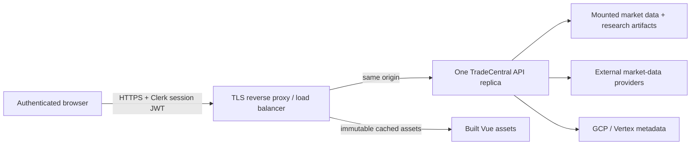

# Production deployment

For the measured findings and remaining scale boundary, see `PRODUCTION_READINESS_AUDIT.md`.

## Supported production shape

TradeCentral is production-hardened for one authenticated research team on a single API replica. Static assets can be cached at a CDN or reverse proxy, but the Python process must remain a single replica because scan jobs, deduplication locks, and live-data caches are process-local.



This is not yet a horizontally scalable multi-tenant service. Running multiple API replicas would create independent scan-job histories, duplicate provider calls, and inconsistent cache state. Before horizontal scaling, move jobs to a durable queue, caches/deduplication to a shared store, and artifacts to versioned object storage or a shared read-only volume.

## Required runtime

- Python 3.10 or newer with the frozen research environment plus `requirements-dashboard.txt`; use Python 3.11+ for new deployments
- Node 18 or newer for building the Vue application
- Local or mounted `data/` and `runs/` artifacts required by the enabled panels
- A TLS-terminating proxy or managed load balancer in front of the Python server
- One Clerk production application with restricted sign-up policy

The dashboard requirements are intentionally additive to `requirements-vertex.txt`; this prevents operator-only dependencies from silently changing model-training runs.

The currently validated local environment is Python 3.10.6. Google client libraries warn that their Python 3.10 support ends on October 4, 2026. Migrate and revalidate the frozen scientific environment on Python 3.11+ before that date; do not silently change the research runtime beneath published model results.

## Build

```bash
python -m pip install -r requirements-vertex.txt -r requirements-dashboard.txt
npm --prefix dashboard ci
npm --prefix dashboard test
npm --prefix dashboard run build
python -m pytest -q tests/e2e/test_tier1_features.py tests/e2e/test_options_toolkit.py
```

Use `npm run build:public` for a public build. It requires a Clerk production
publishable key, Clerk mode, and a production Convex URL. The owner email is
fixed in the SPA; the API and Convex use the exact Clerk user ID. Prefer
same-origin API hosting and leave `VITE_API_BASE_URL` empty.

## Server environment

Use the real HTTPS browser origin in both allowlists:

```dotenv
EDGE_HOST=0.0.0.0
PORT=8787
EDGE_REQUIRE_AUTH=1
EDGE_PUBLIC_DEPLOYMENT=1
EDGE_AUTH_MODE=clerk
CLERK_JWT_KEY="-----BEGIN PUBLIC KEY-----\n...\n-----END PUBLIC KEY-----"
CLERK_AUTHORIZED_PARTIES=https://trade.example.com
EDGE_CORS_ORIGINS=https://trade.example.com
EDGE_OWNER_USER_ID=user_example
EDGE_MAX_CONCURRENT_REQUESTS=32
EDGE_SOCKET_TIMEOUT_S=30
EDGE_ACCESS_LOG=1
```

Start the built application with:

```bash
python tools/api_server.py --no-browser
```

The server refuses to bind to a non-loopback host unless backend JWT verification and an explicit non-wildcard CORS allowlist are configured. Set `EDGE_PUBLIC_DEPLOYMENT=1` when a tunnel or proxy can reach a loopback listener; this requires Clerk mode and an exact owner ID too. `/api/health` remains public for load-balancer health checks; all other API routes require a valid Clerk session token.

Clerk's backend verifier validates the RS256 signature, expiry/not-before claims, token type, and `azp` authorized-party claim locally using `CLERK_JWT_KEY`. `EDGE_ALLOWED_USER_IDS` adds an application-level operator allowlist. Rotate Clerk keys through the deployment secret store, never through the repository.

## Reverse proxy requirements

- Terminate TLS and redirect HTTP to HTTPS.
- Forward `Authorization`, `Origin`, and `X-Forwarded-*` headers unchanged.
- Set an upstream response timeout longer than 30 seconds.
- Do not cache `/api/*` responses; the API emits `Cache-Control: no-store`.
- Cache hashed `/assets/*` responses for one year; the server marks them immutable.
- Keep `/index.html` uncacheable so deployments cannot reference stale asset hashes.
- Limit access logs and monitoring data so bearer tokens and provider credentials are never recorded.

## Capacity and reliability

The server bounds concurrent request threads (32 by default), applies per-connection timeouts, compresses eligible JSON/text responses, and sends security headers. The browser aborts API requests after 30 seconds and polling never stacks while an earlier request is in flight.

The practical bottleneck is provider and scientific-compute latency, not the Vue bundle. Expensive status and options paths already use TTL caches and single-flight locks. Keep one warm replica, alert on `/api/health`, process restarts, 5xx rate, p95 latency, provider quota failures, and stale `asof` timestamps.

## Release gate

Before each deployment:

1. Run the frontend tests and production build.
2. Run the API/e2e contract tests.
3. Start with production environment values and confirm unsafe startup fails when auth is removed.
4. Confirm unauthenticated protected requests return 401 and `/api/health` returns 200.
5. Confirm an allowed Clerk user can load every enabled workspace.
6. Confirm gzip, immutable asset caching, and `no-store` API caching at the public endpoint.
7. Verify mounted datasets/artifacts and provider secrets are present and fresh.
8. Exercise graceful restart during a quiet window; in-process scans do not survive restarts.
