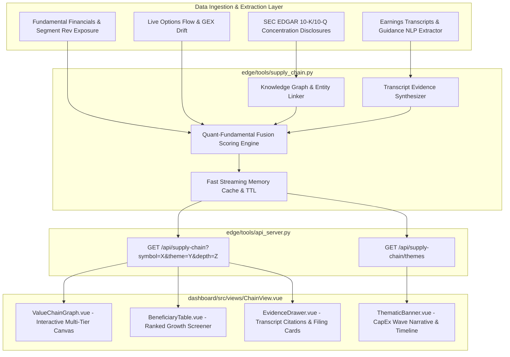

# Feature Design: Supply Chain & Ecosystem Beneficiary Engine (`/chain`)

**Date:** 2026-08-16  
**Status:** Approved & Ready for Implementation  
**Inspired by:** [OpenPlanter](https://github.com/ShinMegamiBoson/OpenPlanter) & Thematic Value Chain Growth Propagation

---

## 1. Summary

The **Supply Chain & Ecosystem Beneficiary Engine** introduces a dedicated top-level dashboard tab (`/chain`) and underlying intelligence engine in TradeCentral. It automatically maps out multi-tier supply chains, extracts supplier-customer concentration disclosures from SEC EDGAR (10-K/10-Q) and earnings transcripts, and predicts second-order growth beneficiaries from major capital expenditure (CapEx) and demand waves (e.g. Hyperscaler Data Center CapEx driving Optics: AAOI, LITE, COHR; Memory/Storage: MU, SNDK, WDC; Power: VST, CEG; Cooling: VRT).

---

## 2. Requirements & Context

### User Goals
1. **Thematic & Ticker Supply Chain Mapping**: Trace the full value chain upstream (raw materials, components, substrates) and downstream (hyperscalers, enterprise customers) for any searched ticker or thematic ecosystem.
2. **Earnings Transcripts & Guidance Extraction**: Extract mentions of supplier capacity crunches, backlog expansions, customer ramps, and CapEx guide raises directly from quarterly calls and SEC filings.
3. **Quant-Fundamental Fusion Growth Prediction**: Calculate a normalized **Beneficiary Elasticity Score** ($0 - 100$) evaluating which suppliers experience the highest revenue expansion and operating leverage from a core driver's spending surge.
4. **Interactive Multi-Tier Visual Canvas**: Interactive SVG/Canvas value chain graph on top, ranked catalyst matrix below, and slide-out transcript evidence drawer.
5. **Primary Navigation Placement**: Positioned prominently in the primary navigation strip (`/chain`, Index `05` / Top-Level).

---

## 3. Architecture & Data Flow



---

## 4. Data Model & Schema

### TypeScript Contract (`dashboard/src/api.ts` & `dashboard/src/chainDisplay.ts`)

```typescript
export type SupplyTier =
  | 'mega_driver'
  | 'tier1_supplier'
  | 'tier2_supplier'
  | 'horizontal_enabler'
  | 'downstream_customer'

export type RelationshipType =
  | 'supplies_to'
  | 'purchases_from'
  | 'co_dependent'
  | 'technology_partner'
  | 'infrastructure_enabler'

export interface ChainEvidence {
  source_type: 'earnings_transcript' | 'sec_10k' | 'sec_10q' | 'guidance_press'
  filing_date: string
  period: string
  speaker?: string
  quote: string
  context: string
  confidence: number // 0.0 to 1.0
}

export interface BeneficiaryMetrics {
  elasticity_score: number          // 0-100 composite growth score
  capex_sensitivity: number         // estimated % revenue gain per 10% driver CapEx surge
  revenue_concentration_pct: number   // % of company's rev tied to this customer/theme
  operating_leverage: number        // EBITDA margin change / Revenue change
  forward_pe: number | null
  peg_ratio: number | null
  gross_margin_trend: 'expanding' | 'stable' | 'contracting'
  yoy_revenue_growth: number | null
  next_earnings_date: string | null
  flow_sentiment_score: number      // -1.0 (bearish) to +1.0 (bullish)
  options_skew: string              // 'bullish_call_drift', 'hedged', etc.
}

export interface SupplyChainNode {
  symbol: string
  name: string
  sector: string
  sub_industry: string             // e.g. "Optical Transceivers", "HBM Memory", "Liquid Cooling"
  tier: SupplyTier
  market_cap_billions: number
  metrics: BeneficiaryMetrics
  evidence: ChainEvidence[]
  is_focus?: boolean
}

export interface SupplyChainEdge {
  id: string
  source: string                   // supplier symbol
  target: string                   // customer/driver symbol
  relationship: RelationshipType
  strength: number                 // 0.0 to 1.0
  supply_category: string          // e.g. "800G/1.6T Transceivers", "HBM3e Memory"
  annual_contract_value_est_m?: number
  evidence_count: number
}

export interface SupplyChainPayload {
  asof: string
  query: { symbol?: string; theme?: string; depth: number }
  focal_entity: SupplyChainNode
  nodes: SupplyChainNode[]
  edges: SupplyChainEdge[]
  thematic_summary: {
    theme_name: string
    capex_catalyst_narrative: string
    total_ecosystem_market_cap_b: number
    top_beneficiaries: string[]
    catalyst_timeline: Array<{ date: string; event: string; impacted_tickers: string[] }>
  }
}
```

---

## 5. Scoring & Elasticity Formulation

The **Beneficiary Elasticity Score** ($S \in [0, 100]$) ranks which supply chain partners will experience the strongest financial and equity appreciation following a CapEx catalyst at the focal company or theme.

$$\text{Elasticity Score} = w_1 \cdot E_{\text{capex}} + w_2 \cdot C_{\text{rev}} + w_3 \cdot L_{\text{op}} + w_4 \cdot M_{\text{flow}} + w_5 \cdot P_{\text{pead}}$$

- **$E_{\text{capex}}$ (CapEx Flow-through Sensitivity)**: Multiplier on how essential the supplier's product category is to next-generation builds (e.g. 800G/1.6T transceivers scaling non-linearly with cluster scale).
- **$C_{\text{rev}}$ (Revenue Concentration %)**: Percentage of supplier revenue directly derived from the theme or mega-cap customer.
- **$L_{\text{op}}$ (Operating Leverage Multiplier)**: Degree of fixed-cost operating leverage turning incremental gross revenue into outsized operating profit beats.
- **$M_{\text{flow}}$ (Options Flow & Volatility Momentum)**: Real-time call sweep aggression, positive gamma exposure (GEX), and directional options flow score.
- **$P_{\text{pead}}$ (Post-Earnings Drift Factor)**: Recent EPS/Rev beat magnitude and subsequent price revision momentum.

---

## 6. Endpoints & API Contracts

### 1. `GET /api/supply-chain`
- **Parameters:**
  - `symbol` (e.g. `NVDA`, `MSFT`, `AAOI`, `MU`): Focus ticker
  - `theme` (e.g. `ai_datacenter`, `semi_equipment`, `agentic_software`, `energy_grid`): Pre-indexed ecosystem
  - `depth` (`1` or `2`): Multi-tier graph depth
  - `force_refresh` (`0` or `1`): Live rescan flag
- **Response:** `SupplyChainPayload` JSON

### 2. `GET /api/supply-chain/themes`
- **Response:** List of supported macro themes, active driver tickers, total ecosystem valuation, and key catalyst events.

---

## 7. Frontend Layout & Components (`dashboard/src/views/ChainView.vue`)

- **Top Bar**: Theme Quick-Pills (AI Data Center, Semi Equipment, Enterprise AI, Energy Grid), Ticker Autocomplete Search Input, Tier Depth Selector (Tier 1 / Multi-Tier), and Refresh / Live Ingest trigger.
- **Top Canvas (`ValueChainGraph.vue`)**: Layered SVG/Canvas graph showing upstream component suppliers on the left/top, enablers in the center, focal driver hubs, and downstream cloud/enterprise consumers on the right. Node clicks highlight interconnected edges and select the beneficiary.
- **Bottom Matrix (`BeneficiaryTable.vue`)**: Sortable, filterable table ranked by Elasticity Score, showing sub-industry tags, CapEx sensitivity multipliers, revenue concentration %, valuation multiples, options flow posture, and citation counts with quick links to `/options` and `/market`.
- **Side Inspector (`EvidenceDrawer.vue`)**: Slides out when a ticker is selected to display verbatim earnings quotes (with speaker attribution & call dates), 10-K customer disclosures, customer breakdown charts, and live options/GEX sentiment.

---

## 8. Implementation Tasks

- [ ] **Task 1: Core Supply Chain Backend Engine** `priority:1` `phase:backend` `time:30min`
  - files: `edge/tools/supply_chain.py`, `tests/test_supply_chain.py`
  - [ ] Implement multi-tier knowledge graph data structures and preset thematic ecosystems (AI Data Center, Semi Equipment, Enterprise AI, Energy Grid).
  - [ ] Implement SEC EDGAR 10-K/10-Q supplier-customer extraction parser and earnings transcript NLP evidence matcher.
  - [ ] Implement Quant-Fundamental Fusion Elasticity scoring formula.
  - [ ] Write comprehensive unit tests in `tests/test_supply_chain.py` and verify all tests pass.

- [ ] **Task 2: API Server Integration** `priority:2` `phase:api` `deps:Task 1` `time:15min`
  - files: `edge/tools/api_server.py`, `tests/test_supply_chain_endpoint.py`
  - [ ] Register `GET /api/supply-chain` and `GET /api/supply-chain/themes` in `api_server.py`.
  - [ ] Add caching with thread-safe TTL and fast error degradation.
  - [ ] Write integration test in `tests/test_supply_chain_endpoint.py` and verify.

- [ ] **Task 3: Dashboard API Client & TypeScript Types** `priority:3` `phase:frontend` `deps:Task 2` `time:15min`
  - files: `dashboard/src/api.ts`, `dashboard/src/chainDisplay.ts`, `dashboard/src/__tests__/chain-display.test.ts`
  - [ ] Add `SupplyChainPayload`, `SupplyChainNode`, `SupplyChainEdge`, `ChainEvidence` types to `dashboard/src/api.ts`.
  - [ ] Add `api.supplyChain()` and `api.supplyChainThemes()` client methods.
  - [ ] Implement display formatters and rank utilities in `chainDisplay.ts`.
  - [ ] Write unit tests in `dashboard/src/__tests__/chain-display.test.ts` and verify.

- [ ] **Task 4: Interactive Graph & Screener Components** `priority:4` `phase:ui` `deps:Task 3` `time:35min`
  - files: `dashboard/src/components/ValueChainGraph.vue`, `dashboard/src/components/BeneficiaryTable.vue`, `dashboard/src/components/EvidenceDrawer.vue`, `dashboard/src/components/ThematicBanner.vue`
  - [ ] Build `ValueChainGraph.vue` using deterministic SVG tier layout, glowing animated flow links, and node selection.
  - [ ] Build `BeneficiaryTable.vue` with sorting by Elasticity, filtering by sub-industry, and quick trade setup chips.
  - [ ] Build `EvidenceDrawer.vue` rendering verbatim transcript citations, speaker notes, and customer concentration breakdown.
  - [ ] Build `ThematicBanner.vue` showing macro CapEx driver summary and catalyst timeline.

- [ ] **Task 5: ChainView Route & Primary Navigation Integration** `priority:5` `phase:ui` `deps:Task 4` `time:15min`
  - files: `dashboard/src/views/ChainView.vue`, `dashboard/src/router.ts`, `dashboard/src/App.vue`, `dashboard/src/components/AppIcon.vue`
  - [ ] Create `ChainView.vue` integrating the graph, table, banner, and drawer.
  - [ ] Add `/chain` route to `router.ts` with title `Supply Chain` and index `05`.
  - [ ] Add `Chain` top-level tab to `primaryNav` in `App.vue` with icon `chain` and update icon renderer.
  - [ ] Verify UI tests and frontend build (`npm run test` / `npm run build`).
